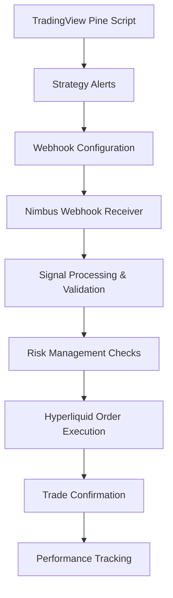

## What is PineScript Integration?

Nimbus's PineScript Integration allows you to execute your TradingView Pine Script strategies directly on Hyperliquid through webhook automation. This bridges the gap between TradingView's powerful charting and strategy development environment and real-world trading execution.

## How PineScript Integration Works

Connect your TradingView strategies to Nimbus for seamless automated execution:

<Info>
  **Example Workflow**: 1. Develop your strategy in TradingView Pine Script 2.
  Configure webhook alerts in TradingView 3. Connect webhook to Nimbus
  execution engine 4. Nimbus automatically executes trades on Hyperliquid
  5. Monitor performance and adjust parameters as needed

</Info>

### Integration Architecture



## Setting Up PineScript Integration

### Step 1: TradingView Setup

Configure your TradingView environment for webhook integration:

<AccordionGroup>
<Accordion icon="code" title="Pine Script Strategy Setup">
**Prepare your strategy for webhook alerts:**

```pinescript
//@version=5
strategy("Nimbus Integration Example", overlay=true, default_qty_type=strategy.percent_of_equity, default_qty_value=10)

// Strategy parameters
fast_length = input.int(12, title="Fast MA Length")
slow_length = input.int(26, title="Slow MA Length")
risk_percent = input.float(2.0, title="Risk Percent", minval=0.1, maxval=10.0)

// Calculate moving averages
fast_ma = ta.ema(close, fast_length)
slow_ma = ta.ema(close, slow_length)

// Entry conditions
long_condition = ta.crossover(fast_ma, slow_ma)
short_condition = ta.crossunder(fast_ma, slow_ma)

// Strategy execution with webhook messages
if long_condition
    strategy.entry("Long", strategy.long, alert_message='{"action":"buy","symbol":"ETH","size":10,"stop_loss":2,"take_profit":6}')

if short_condition
    strategy.entry("Short", strategy.short, alert_message='{"action":"sell","symbol":"ETH","size":10,"stop_loss":2,"take_profit":6}')

// Exit conditions
if strategy.position_size > 0 and ta.crossunder(fast_ma, slow_ma)
    strategy.close("Long", alert_message='{"action":"close","symbol":"ETH","position":"long"}')

if strategy.position_size < 0 and ta.crossover(fast_ma, slow_ma)
    strategy.close("Short", alert_message='{"action":"close","symbol":"ETH","position":"short"}')
```

**Key Elements for Integration**:

- Use `alert_message` parameter in strategy calls
- Structure messages as JSON for easy parsing
- Include all necessary trade parameters
- Define clear entry and exit conditions

</Accordion>

<Accordion icon="bell" title="Alert Configuration">
**Set up TradingView alerts for your strategy:**

1. **Create Alert**: Click "Alert" button on TradingView chart
2. **Select Condition**: Choose your strategy from dropdown
3. **Configure Webhook**:
   - **Webhook URL**: `https://api.nimbus.trade/webhook/tv/{your-webhook-id}`
   - **Message**: Use `{{strategy.order.alert_message}}` to pass Pine Script data
4. **Alert Settings**:
   - **Name**: Descriptive name for your strategy
   - **Frequency**: "All" for every signal
   - **Expiration**: Set appropriate timeframe

</Accordion>

</AccordionGroup>

### Step 2: Nimbus Configuration

Connect your TradingView alerts to Nimbus execution:

<AccordionGroup>
<Accordion icon="link" title="Webhook Setup">

**Create and configure your webhook endpoint:**

1. **Navigate to Integrations**: Go to Dashboard → Integrations → PineScript
2. **Create New Webhook**: Click "Add TradingView Webhook"
3. **Configure Settings**:
   ```javascript
   Webhook Configuration:
   ├── Name: "My EMA Cross Strategy"
   ├── Asset Mapping: ETH → ETH/USDC
   ├── Position Sizing: Dynamic (based on signal)
   ├── Risk Management: Enabled
   ├── Max Position Size: $1,000
   ├── Daily Trade Limit: 10
   └── Status: Active
   ```
4. **Copy Webhook URL**: Use this in your TradingView alert

</Accordion>

<Accordion icon="shield" title="Risk Management Setup">
**Configure safety controls for automated execution:**

- **Position Limits**: Maximum position size per trade
- **Daily Limits**: Maximum number of trades per day
- **Portfolio Limits**: Maximum exposure across all strategies
- **Asset Restrictions**: Which assets can be traded
- **Time Restrictions**: Trading hours and blackout periods
- **Volatility Filters**: Pause during extreme volatility
- **Manual Override**: Emergency stop capabilities

</Accordion>

</AccordionGroup>

## Advanced PineScript Features

### Dynamic Position Sizing

Implement sophisticated position sizing based on market conditions:

<AccordionGroup>
<Accordion icon="calculator" title="Risk-Based Sizing">
**Position sizing based on risk parameters:**

```pinescript
// Risk management inputs
risk_per_trade = input.float(2.0, title="Risk Per Trade (%)", minval=0.1, maxval=10.0)
atr_length = input.int(14, title="ATR Length")
max_position = input.float(20.0, title="Max Position (%)", minval=1.0, maxval=50.0)

// Calculate ATR for stop loss
atr = ta.atr(atr_length)
stop_distance = atr * 2 // 2 ATR stop loss

// Calculate position size based on risk
account_value = strategy.equity
risk_amount = account_value * (risk_per_trade / 100)
position_size = math.min(risk_amount / (stop_distance * syminfo.pointvalue),
                        account_value * (max_position / 100) / close)

// Include position size in webhook message
long_alert = '{"action":"buy","symbol":"' + syminfo.ticker + '","size":' + str.tostring(position_size) + ',"stop_loss":' + str.tostring(stop_distance) + '}'
```

</Accordion>

<Accordion icon="chart-line" title="Market Condition Adaptation">
**Adjust strategy behavior based on market regime:**

```pinescript
// Market regime detection
volatility = ta.stdev(ta.change(close), 20)
avg_volatility = ta.sma(volatility, 50)
high_vol_threshold = avg_volatility * 1.5
low_vol_threshold = avg_volatility * 0.5

// Regime classification
market_regime = volatility > high_vol_threshold ? "high_vol" :
                volatility < low_vol_threshold ? "low_vol" : "normal"

// Adjust position sizing based on regime
vol_multiplier = market_regime == "high_vol" ? 0.5 :
                 market_regime == "low_vol" ? 1.5 : 1.0

adjusted_size = base_position_size * vol_multiplier

// Include regime information in webhook
regime_alert = '{"action":"buy","symbol":"' + syminfo.ticker + '","size":' + str.tostring(adjusted_size) + ',"regime":"' + market_regime + '"}'
```

</Accordion>

</AccordionGroup>

### Multi-Asset Strategies

Execute coordinated strategies across multiple assets:

<CardGroup cols={2}>
<Card title="Pair Trading" icon="arrows-left-right">
**Relative value strategies:**
- ETH/BTC ratio trading
- DeFi token pair analysis
- Spread trading between correlated assets
- Mean reversion on price relationships

</Card>

<Card title="Portfolio Strategies" icon="chart-pie">
**Multi-asset allocation:**
- Sector rotation strategies
- Risk parity implementations
- Momentum-based allocation
- Correlation-based hedging

</Card>

</CardGroup>

## Message Format & Protocol

### Webhook Message Structure

Nimbus supports flexible JSON message formats:

<AccordionGroup>
<Accordion icon="code" title="Basic Trade Messages">
**Standard buy/sell signal format:**

```json
{
  "action": "buy", // "buy", "sell", "close"
  "symbol": "ETH", // Asset symbol
  "size": 100, // Position size in USD
  "type": "market", // "market", "limit"
  "price": 2000, // Limit price (optional)
  "stop_loss": 1950, // Stop loss price (optional)
  "take_profit": 2100, // Take profit price (optional)
  "time_in_force": "GTC", // "GTC", "IOC", "FOK"
  "reduce_only": false // Only reduce existing position
}
```

</Accordion>

<Accordion icon="gear" title="Advanced Message Options">
**Extended parameters for sophisticated strategies:**

```json
{
  "action": "buy",
  "symbol": "ETH",
  "size": 100,
  "strategy_id": "ema_cross_v2",
  "signal_strength": 0.75,
  "market_regime": "trending",
  "risk_parameters": {
    "max_drawdown": 0.05,
    "position_limit": 0.1,
    "time_limit": 3600
  },
  "execution_params": {
    "slippage_tolerance": 0.001,
    "split_orders": true,
    "execution_window": 300
  },
  "metadata": {
    "tv_time": "2024-01-15T10:30:00Z",
    "tv_ticker": "ETHUSDT",
    "signal_id": "12345"
  }
}
```

</Accordion>

</AccordionGroup>

### Error Handling & Validation

Robust error handling ensures reliable strategy execution:

<CardGroup cols={2}>
<Card title="Message Validation" icon="check-circle">
**Automatic validation checks:**
- JSON format validation
- Required field verification
- Parameter range checking
- Asset symbol validation
- Position size limits

</Card>

<Card title="Execution Monitoring" icon="eye">
**Real-time execution tracking:**
- Order status updates
- Fill confirmations
- Error notifications
- Performance metrics
- Latency monitoring

</Card>

</CardGroup>

## Strategy Examples & Templates

### Moving Average Crossover

Complete implementation of a classic crossover strategy:

<AccordionGroup>
<Accordion icon="chart-line" title="EMA Cross Strategy">
**Full Pine Script implementation:**

```pinescript
//@version=5
strategy("Nimbus EMA Cross", overlay=true,
         default_qty_type=strategy.percent_of_equity, default_qty_value=10,
         commission_type=strategy.commission.percent, commission_value=0.1)

// Strategy inputs
fast_length = input.int(12, "Fast EMA", minval=1)
slow_length = input.int(26, "Slow EMA", minval=1)
risk_percent = input.float(2.0, "Risk per Trade (%)", minval=0.1, maxval=10.0)
use_atr_stops = input.bool(true, "Use ATR Stops")
atr_multiplier = input.float(2.0, "ATR Multiplier", minval=0.5, maxval=5.0)

// Calculate indicators
fast_ema = ta.ema(close, fast_length)
slow_ema = ta.ema(close, slow_length)
atr = ta.atr(14)

// Plot EMAs
plot(fast_ema, "Fast EMA", color=color.blue)
plot(slow_ema, "Slow EMA", color=color.red)

// Entry conditions
bullish_cross = ta.crossover(fast_ema, slow_ema)
bearish_cross = ta.crossunder(fast_ema, slow_ema)

// Calculate position size
stop_distance = use_atr_stops ? atr * atr_multiplier : close * 0.02
risk_amount = strategy.equity * (risk_percent / 100)
position_size = risk_amount / stop_distance

// Long entry
if bullish_cross and strategy.position_size == 0
    stop_price = close - stop_distance
    take_profit_price = close + (stop_distance * 2)

    alert_msg = '{"action":"buy","symbol":"ETH","size":' + str.tostring(math.round(position_size)) +
                ',"stop_loss":' + str.tostring(stop_price) +
                ',"take_profit":' + str.tostring(take_profit_price) + '}'

    strategy.entry("Long", strategy.long, qty=position_size, alert_message=alert_msg)
    strategy.exit("Long Exit", "Long", stop=stop_price, limit=take_profit_price)

// Short entry
if bearish_cross and strategy.position_size == 0
    stop_price = close + stop_distance
    take_profit_price = close - (stop_distance * 2)

    alert_msg = '{"action":"sell","symbol":"ETH","size":' + str.tostring(math.round(position_size)) +
                ',"stop_loss":' + str.tostring(stop_price) +
                ',"take_profit":' + str.tostring(take_profit_price) + '}'

    strategy.entry("Short", strategy.short, qty=position_size, alert_message=alert_msg)
    strategy.exit("Short Exit", "Short", stop=stop_price, limit=take_profit_price)
```

</Accordion>

</AccordionGroup>

### RSI Mean Reversion

Contrarian strategy based on RSI extremes:

<AccordionGroup>
<Accordion icon="arrows-rotate" title="RSI Reversal Strategy">
**Complete mean reversion implementation:**

```pinescript
//@version=5
strategy("Nimbus RSI Reversal", overlay=false,
         default_qty_type=strategy.percent_of_equity, default_qty_value=5)

// RSI settings
rsi_length = input.int(14, "RSI Length")
oversold_level = input.int(30, "Oversold Level")
overbought_level = input.int(70, "Overbought Level")
exit_level = input.int(50, "Exit Level")

// Position sizing
position_percent = input.float(5.0, "Position Size (%)")
max_trades_per_day = input.int(3, "Max Trades per Day")

// Calculate RSI
rsi = ta.rsi(close, rsi_length)

// Plot RSI
plot(rsi, "RSI", color=color.purple)
hline(overbought_level, "Overbought", color=color.red)
hline(oversold_level, "Oversold", color=color.green)
hline(exit_level, "Exit Level", color=color.gray)

// Trade counting (simplified)
var int trades_today = 0
if ta.change(time("1D"))
    trades_today := 0

// Entry conditions
oversold_entry = rsi < oversold_level and rsi > rsi[1] and trades_today < max_trades_per_day
overbought_entry = rsi > overbought_level and rsi < rsi[1] and trades_today < max_trades_per_day

// Calculate position size
position_value = strategy.equity * (position_percent / 100)
shares = position_value / close

// Long entries on oversold bounce
if oversold_entry and strategy.position_size == 0
    alert_msg = '{"action":"buy","symbol":"ETH","size":' + str.tostring(math.round(position_value)) +
                ',"strategy":"rsi_reversal","rsi":' + str.tostring(rsi) + '}'

    strategy.entry("Long", strategy.long, qty=shares, alert_message=alert_msg)
    trades_today += 1

// Short entries on overbought rejection
if overbought_entry and strategy.position_size == 0
    alert_msg = '{"action":"sell","symbol":"ETH","size":' + str.tostring(math.round(position_value)) +
                ',"strategy":"rsi_reversal","rsi":' + str.tostring(rsi) + '}'

    strategy.entry("Short", strategy.short, qty=shares, alert_message=alert_msg)
    trades_today += 1

// Exit conditions
if strategy.position_size > 0 and ta.crossover(rsi, exit_level)
    strategy.close("Long", alert_message='{"action":"close","symbol":"ETH","position":"long"}')

if strategy.position_size < 0 and ta.crossunder(rsi, exit_level)
    strategy.close("Short", alert_message='{"action":"close","symbol":"ETH","position":"short"}')
```

</Accordion>

</AccordionGroup>

## Performance Monitoring & Optimization

### Real-Time Monitoring

Track your PineScript strategy performance:

<CardGroup cols={3}>
<Card title="Execution Metrics" icon="zap">
Signal-to-execution latency, fill rates, and slippage analysis

</Card>

<Card title="Strategy Performance" icon="chart-line">
  Returns, Sharpe ratio, max drawdown, and win rate tracking

</Card>

<Card title="Risk Monitoring" icon="shield-check">
Position sizing compliance, risk limit adherence, and exposure tracking

</Card>

</CardGroup>

### Optimization Strategies

<AccordionGroup>
<Accordion icon="sliders" title="Parameter Optimization">
**Systematic parameter tuning:**
- **Backtest optimization**: Test parameter ranges in TradingView
- **Walk-forward analysis**: Validate parameters on out-of-sample data
- **Monte Carlo testing**: Assess parameter robustness
- **Live performance tracking**: Monitor parameter effectiveness

</Accordion>

<Accordion icon="brain" title="Adaptive Strategies">
**Self-optimizing implementations:**
- **Dynamic parameters**: Adjust based on market conditions
- **Regime detection**: Different parameters for different market states
- **Performance feedback**: Modify behavior based on recent results
- **Machine learning integration**: Use ML for parameter optimization

</Accordion>

</AccordionGroup>

## Troubleshooting & Best Practices

### Common Issues & Solutions

<AccordionGroup>
<Accordion icon="exclamation-triangle" title="Webhook Delivery Issues">
**Problem**: Alerts not reaching Nimbus

**Solutions**:

- Verify webhook URL is correct and active
- Check TradingView alert configuration
- Ensure JSON message format is valid
- Test webhook with manual curl command
- Check for TradingView Pro subscription requirements

</Accordion>

<Accordion icon="clock" title="Execution Delays">
**Problem**: Significant delay between signal and execution

**Solutions**:

- Optimize Pine Script for faster alert generation
- Use simpler message formats to reduce processing time
- Check Hyperliquid network status and congestion
- Consider using limit orders with favorable pricing
- Monitor and optimize webhook server performance

</Accordion>

</AccordionGroup>

### Best Practices

<CheckList>
  - Always backtest thoroughly in TradingView before going live - Start with
  small position sizes and gradually scale up - Use proper risk management
  including stop losses and position limits - Monitor strategy performance
  regularly and adjust parameters as needed - Keep webhook messages simple and
  focused on essential information - Implement proper error handling and
  fallback mechanisms - Test webhook connectivity regularly to ensure
  reliability

</CheckList>

## Advanced Integration Features

### Multi-Timeframe Strategies

Implement strategies that analyze multiple timeframes:

<AccordionGroup>
<Accordion icon="clock" title="Higher Timeframe Confirmation">
**Combine multiple timeframe signals:**

```pinescript
// Higher timeframe trend
htf_trend = request.security(syminfo.tickerid, "4h", ta.ema(close, 50))
trend_bullish = close > htf_trend
trend_bearish = close < htf_trend

// Only trade in direction of higher timeframe trend
long_allowed = trend_bullish and bullish_cross
short_allowed = trend_bearish and bearish_cross

// Include trend context in webhook
trend_context = trend_bullish ? "bullish" : "bearish"
alert_msg = '{"action":"buy","symbol":"ETH","size":100,"htf_trend":"' + trend_context + '"}'
```

</Accordion>

</AccordionGroup>

## Next Steps

<CardGroup cols={2}>
<Card title="Webhook Configuration" icon="link" href="/advanced/webhook-configuration">
  Set up and manage webhook endpoints for strategy execution.

</Card>

<Card
  title="Backtesting Engine"
  icon="clock-rotate-left"
  href="/advanced/backtesting-engine"
>
  Test your PineScript strategies against historical data.

</Card>

<Card
  title="Signal-Based Trading"
  icon="radar"
  href="/trading-strategies/signal-based-trading"
>
  Combine PineScript with Nimbus's proprietary signals.

</Card>

<Card title="Portfolio Dashboard" icon="chart-mixed" href="/portfolio/dashboard">
  Monitor your PineScript strategy performance.

</Card>

</CardGroup>

<Note>
  PineScript integration provides powerful flexibility for strategy development
  while maintaining the safety and risk management features of the Nimbus
  platform. Always test thoroughly before deploying real capital.

</Note>{" "}
