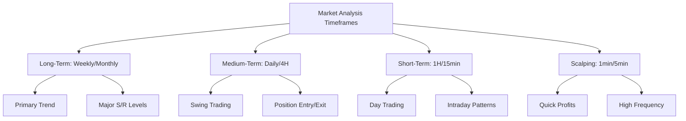

## Introduction to Market Analysis

Effective market analysis is the foundation of successful automated trading. Understanding market dynamics, identifying trends, and recognizing patterns can significantly improve your strategy performance. This guide covers essential analysis techniques for crypto markets.

<CardGroup cols={2}>
  <Card title="Technical Analysis" icon="chart-line">
    Price action and indicator-based analysis
  
</Card>
  <Card title="Market Structure" icon="building">
    Understanding market microstructure and mechanics
  
</Card>
  <Card title="Sentiment Analysis" icon="heart">
    Gauging market psychology and positioning
  
</Card>
  <Card title="Multi-Timeframe Analysis" icon="clock">
    Analyzing markets across different timeframes
  
</Card>

</CardGroup>

## Technical Analysis Fundamentals

### Price Action Analysis

<AccordionGroup>
  <Accordion title="Support and Resistance">
    Identify key price levels where buying and selling pressure concentrates -
    **Horizontal Levels**: Previous highs and lows that act as barriers -
    **Dynamic Levels**: Moving averages and trendlines - **Psychological
    Levels**: Round numbers (e.g., $50,000 for BTC) - **Volume-Weighted
    Levels**: Price levels with significant trading volume

</Accordion>

{" "}

<Accordion title="Trend Analysis">
  Determine the overall direction of market movement - **Uptrend**: Higher highs
  and higher lows - **Downtrend**: Lower highs and lower lows -
  **Sideways/Range**: Price oscillates between support and resistance - **Trend
  Strength**: Rate of change and consistency of direction

</Accordion>

  <Accordion title="Chart Patterns">
    Recognize recurring patterns that suggest future price direction ```mermaid
    graph TD A[Chart Patterns] --> B[Continuation Patterns] A --> C[Reversal
    Patterns] B --> B1[Triangles] B --> B2[Flags] B --> B3[Pennants] B -->
    B4[Rectangles] C --> C1[Head & Shoulders] C --> C2[Double Top/Bottom] C -->
    C3[Cup & Handle] C --> C4[Wedges] ```

</Accordion>

</AccordionGroup>

### Technical Indicators

<Info>
  Technical indicators are mathematical calculations based on price and volume
  data that help identify trends and momentum.

</Info>

#### Trend-Following Indicators

<AccordionGroup>
  <Accordion title="Moving Averages">
    Smooth price data to identify trend direction - **Simple Moving Average
    (SMA)**: Equal weight to all periods - **Exponential Moving Average (EMA)**:
    More weight to recent prices - **Weighted Moving Average (WMA)**: Linear
    weighting scheme - **Hull Moving Average (HMA)**: Reduced lag smoothing
    **Common Strategies:** - MA crossovers (fast MA crosses slow MA) - Price vs
    MA (price above/below moving average) - Multiple MA system (50, 100, 200
    period MAs)

</Accordion>

{" "}

<Accordion title="MACD (Moving Average Convergence Divergence)">
  Momentum oscillator showing relationship between two moving averages ``` MACD
  Line = 12-period EMA - 26-period EMA Signal Line = 9-period EMA of MACD Line
  Histogram = MACD Line - Signal Line ``` **Signals:** - MACD line crosses
  above/below signal line - MACD line crosses above/below zero line - Divergence
  between MACD and price

</Accordion>

  <Accordion title="ADX (Average Directional Index)">
    Measures trend strength regardless of direction - **ADX Values**: 0-100
    scale - **Weak Trend**: ADX below 25 - **Strong Trend**: ADX above 50 -
    **Very Strong Trend**: ADX above 75 **Usage:** Filter trades to only take
    signals during strong trends

</Accordion>

</AccordionGroup>

#### Oscillators and Momentum Indicators

<AccordionGroup>
  <Accordion title="RSI (Relative Strength Index)">
    Momentum oscillator measuring speed and change of price movements
    ```
    RSI = 100 - (100 / (1 + RS))
    RS = Average Gain / Average Loss
    ```
    
    **Interpretation:**
    - **Overbought**: RSI > 70
    - **Oversold**: RSI < 30
    - **Bullish Divergence**: Price makes lower low, RSI makes higher low
    - **Bearish Divergence**: Price makes higher high, RSI makes lower high

</Accordion>
  
  <Accordion title="Stochastic Oscillator">
    Compares closing price to price range over time period
    ```
    %K = 100 × (Close - Lowest Low) / (Highest High - Lowest Low)
    %D = 3-period moving average of %K
    ```
    
    **Signals:**
    - %K crosses above/below %D
    - Values above 80 (overbought) or below 20 (oversold)
    - Divergence with price action

</Accordion>
  
  <Accordion title="Williams %R">
    Momentum indicator showing relationship of close to high-low range
    - **Range**: -100 to 0
    - **Overbought**: Above -20
    - **Oversold**: Below -80
    - **Similar to Stochastic**: But unbounded and faster

</Accordion>

</AccordionGroup>

#### Volume-Based Indicators

<AccordionGroup>
  <Accordion title="Volume Weighted Average Price (VWAP)">
    Average price weighted by volume
    ```
    VWAP = Σ(Price × Volume) / Σ(Volume)
    ```
    
    **Usage:**
    - **Institutional Reference**: Large traders use VWAP as benchmark
    - **Support/Resistance**: Price often respects VWAP levels
    - **Trend Confirmation**: Price above VWAP suggests bullish sentiment

</Accordion>
  
  <Accordion title="On-Balance Volume (OBV)">
    Cumulative indicator using volume to predict price changes
    ```
    If Close > Previous Close: OBV = Previous OBV + Volume
    If Close < Previous Close: OBV = Previous OBV - Volume
    If Close = Previous Close: OBV = Previous OBV
    ```
    
    **Signals:**
    - OBV trend confirmation with price trend
    - Divergence between OBV and price
    - OBV breakouts preceding price breakouts

</Accordion>
  
  <Accordion title="Volume Profile">
    Shows volume traded at different price levels
    - **Value Area**: 70% of volume traded within price range
    - **Point of Control (POC)**: Price level with highest volume
    - **High Volume Nodes**: Significant support/resistance levels
    - **Low Volume Nodes**: Areas of potential quick price movement

</Accordion>

</AccordionGroup>

## Market Structure Analysis

### Order Book Analysis

<Warning>
  Order book analysis requires real-time data and can change rapidly, making it
  more suitable for short-term strategies.

</Warning>

<AccordionGroup>
  <Accordion title="Bid-Ask Spread Analysis">
    Evaluate market liquidity and trading costs - **Tight Spreads**: High
    liquidity, low trading costs - **Wide Spreads**: Low liquidity, high trading
    costs - **Spread Widening**: Often precedes significant price moves -
    **Normal vs Crisis Spreads**: Compare current to historical averages

</Accordion>

{" "}

<Accordion title="Market Depth">
  Analyze buy and sell order distribution - **Depth Imbalance**: More buy orders
  (bullish) or sell orders (bearish) - **Large Orders**: Significant
  support/resistance levels - **Iceberg Orders**: Hidden large orders revealed
  gradually - **Spoofing Detection**: Fake orders placed to manipulate price

</Accordion>

  <Accordion title="Order Flow">
    Track actual trade executions and their impact - **Buy vs Sell Volume**:
    Aggressive buying vs selling pressure - **Large Block Trades**:
    Institutional activity indicators - **Time and Sales**: Sequence and size of
    actual trades - **Market vs Limit Orders**: Aggressive vs passive trading
    behavior

</Accordion>

</AccordionGroup>

### Market Microstructure

<AccordionGroup>
  <Accordion title="Tick Analysis">
    Examine individual price changes - **Uptick**: Trade executed above previous
    trade price - **Downtick**: Trade executed below previous trade price -
    **Tick Volume**: Number of price changes rather than share volume - **Plus
    Tick Rule**: Regulations affecting short selling

</Accordion>

{" "}

<Accordion title="Market Making vs Taking">
  Understand different trading behaviors - **Market Makers**: Provide liquidity,
  profit from spread - **Market Takers**: Remove liquidity, pay spread -
  **Maker/Taker Ratio**: Indicates market aggression level - **Rebate
  Programs**: Exchanges incentivize market making

</Accordion>

  <Accordion title="Latency and Speed">
    Consider technology's impact on markets - **High-Frequency Trading (HFT)**:
    Microsecond execution times - **Latency Arbitrage**: Profit from speed
    differences - **Co-location**: Physical proximity to exchange servers -
    **Impact on Retail**: How HFT affects individual traders

</Accordion>

</AccordionGroup>

## Sentiment Analysis

### On-Chain Analysis (Crypto-Specific)

<Info>
  Blockchain data provides unique insights into crypto market sentiment and
  participant behavior.

</Info>

<AccordionGroup>
  <Accordion title="Network Activity Metrics">
    Analyze blockchain usage and adoption - **Active Addresses**: Number of
    unique addresses transacting - **Transaction Count**: Daily transaction
    volume - **Transaction Fees**: Network congestion indicator - **Hash Rate**:
    Mining activity and network security

</Accordion>

{" "}

<Accordion title="Exchange Flow Analysis">
  Track cryptocurrency movements to/from exchanges - **Exchange Inflows**:
  Potential selling pressure - **Exchange Outflows**: Potential hodling behavior
  - **Exchange Balances**: Available supply for trading - **Stablecoin Flows**:
  Preparation for buying/selling

</Accordion>

  <Accordion title="Long-Term Holder Metrics">
    Understand investor conviction and accumulation patterns - **HODL Waves**:
    Distribution of coins by holding period - **Realized vs Unrealized Gains**:
    Profit-taking behavior - **Coin Days Destroyed**: Long-term holder selling
    activity - **Supply Distribution**: Concentration among addresses

</Accordion>

</AccordionGroup>

### Social Sentiment Indicators

<AccordionGroup>
  <Accordion title="Fear and Greed Index">
    Composite sentiment indicator for crypto markets - **Components**:
    Volatility, momentum, social media, surveys, dominance - **Scale**: 0
    (Extreme Fear) to 100 (Extreme Greed) - **Contrarian Indicator**: High greed
    may signal tops, extreme fear may signal bottoms - **Strategy Application**:
    Increase allocation during fear, reduce during greed

</Accordion>

{" "}

<Accordion title="Social Media Analysis">
  Monitor sentiment across social platforms - **Twitter/X Sentiment**: Real-time
  sentiment analysis - **Reddit Activity**: Community engagement and discussions
  - **Telegram Groups**: Insider sentiment and information flow - **Google
  Trends**: Public interest and search volume

</Accordion>

  <Accordion title="News Sentiment">
    Analyze impact of news and events - **Fundamental News**: Regulatory
    changes, adoption news - **Technical News**: Network upgrades, security
    issues - **Market News**: Institutional involvement, ETF approvals -
    **Sentiment Scoring**: Automated positive/negative classification

</Accordion>

</AccordionGroup>

### Institutional Activity Indicators

<AccordionGroup>
  <Accordion title="Futures and Options Markets">
    Analyze derivative markets for institutional sentiment - **Futures Basis**:
    Difference between futures and spot prices - **Open Interest**: Total
    outstanding derivative contracts - **Put/Call Ratio**: Options market
    sentiment indicator - **Volatility Surface**: Implied volatility across
    strikes and expirations

</Accordion>

  <Accordion title="Grayscale and ETF Flows">
    Monitor institutional investment vehicles - **Grayscale Premium/Discount**:
    Institutional demand indicator - **ETF Inflows/Outflows**: Traditional
    finance participation - **Custody Services**: Institutional infrastructure
    adoption - **Corporate Treasury**: Public company bitcoin adoption

</Accordion>

</AccordionGroup>

## Multi-Timeframe Analysis

### Timeframe Hierarchy

<Tip>
  Align your trading timeframe with higher timeframe trends for better success
  rates.

</Tip>



<AccordionGroup>
  <Accordion title="Top-Down Analysis">
    Start with higher timeframes and work down 1. **Monthly/Weekly**: Identify
    primary trend and major levels 2. **Daily**: Confirm trend and find
    intermediate levels 3. **4-Hour**: Refine entry/exit timing 4. **1-Hour**:
    Fine-tune execution and risk management 5. **Lower Timeframes**: Precise
    entry and exit points

</Accordion>

{" "}

<Accordion title="Timeframe Confluence">
  Look for alignment across multiple timeframes - **Trend Alignment**: All
  timeframes showing same direction - **Support/Resistance**: Levels that align
  across timeframes - **Indicator Confluence**: Multiple indicators agreeing -
  **Pattern Confirmation**: Patterns visible on multiple timeframes

</Accordion>

  <Accordion title="Timeframe-Specific Strategies">
    Adapt strategy to appropriate timeframe - **Scalping (1-5min)**: High
    frequency, small profits, tight stops - **Day Trading (15min-1H)**: Intraday
    moves, daily targets - **Swing Trading (4H-Daily)**: Multi-day holds, larger
    moves - **Position Trading (Weekly+)**: Long-term trends, fundamental
    drivers

</Accordion>

</AccordionGroup>

## Market Regime Analysis

### Identifying Market Conditions

<AccordionGroup>
  <Accordion title="Trending Markets">
    Characteristics and strategies for trending conditions - **High ADX**:
    Strong directional movement - **Moving Average Alignment**: MAs stacked in
    order - **Breakout Patterns**: Price breaking key levels - **Strategy
    Focus**: Trend-following systems, momentum strategies

</Accordion>

{" "}

<Accordion title="Range-Bound Markets">
  Sideways market characteristics and approaches - **Low ADX**: Weak directional
  bias - **Oscillating Indicators**: RSI/Stochastic reversals -
  **Support/Resistance Respect**: Price bouncing between levels - **Strategy
  Focus**: Mean reversion, range trading, grid strategies

</Accordion>

  <Accordion title="Volatile Markets">
    High volatility environments and risk management - **High ATR**: Increased
    price swings - **News-Driven**: Event-based volatility spikes - **Whipsaw
    Action**: Rapid direction changes - **Strategy Adjustments**: Wider stops,
    smaller positions, shorter holds

</Accordion>

</AccordionGroup>

### Volatility Analysis

<AccordionGroup>
  <Accordion title="Historical Volatility">
    Measure actual price movement over time ``` Historical Volatility = Standard
    Deviation of Returns × √(252) ``` - **Realized Volatility**: Past price
    movement - **Rolling Windows**: 30, 60, 90-day periods - **Volatility
    Regimes**: High vs low volatility periods - **Volatility Clustering**:
    Tendency for volatility to cluster

</Accordion>

{" "}

<Accordion title="Implied Volatility">
  Market's expectation of future volatility from options - **IV vs HV**: Compare
  expected to realized volatility - **Volatility Smile**: IV varies by strike
  price - **Term Structure**: IV varies by expiration - **VIX Equivalent**:
  Crypto volatility indices

</Accordion>

  <Accordion title="Volatility-Based Strategies">
    Adapt trading based on volatility conditions - **Low Volatility**: Increase
    position sizes, use tighter stops - **High Volatility**: Decrease position
    sizes, use wider stops - **Volatility Breakouts**: Trade volatility
    expansion - **Volatility Reversion**: Trade volatility contraction

</Accordion>

</AccordionGroup>

## Correlation Analysis

### Asset Correlation

<Warning>
  Correlations can change rapidly during market stress, potentially invalidating
  diversification strategies.

</Warning>

<AccordionGroup>
  <Accordion title="Crypto-Crypto Correlations">
    Relationships between different cryptocurrencies
    - **BTC Dominance**: Bitcoin's influence on altcoins
    - **Sector Correlations**: DeFi, gaming, infrastructure tokens
    - **Size-Based Correlations**: Large vs small cap cryptos
    - **Rolling Correlations**: Time-varying correlation analysis

</Accordion>
  
  <Accordion title="Crypto-Traditional Asset Correlations">
    Relationships with traditional financial markets
    - **Crypto vs Stocks**: Risk-on/risk-off behavior
    - **Crypto vs Gold**: Alternative store of value comparison
    - **Crypto vs USD**: Dollar strength impact
    - **Crypto vs Bonds**: Interest rate sensitivity

</Accordion>
  
  <Accordion title="Dynamic Correlation Monitoring">
    Track changing correlation patterns
    ```json
    {
      "correlation_monitoring": {
        "window_days": 30,
        "assets": ["BTC", "ETH", "SOL", "ADA"],
        "alerts": {
          "high_correlation_threshold": 0.8,
          "correlation_spike_alert": true,
          "decorrelation_threshold": 0.3
        }
      }
    }
    ```

</Accordion>

</AccordionGroup>

## Economic Calendar and Events

### Macro Economic Events

<AccordionGroup>
  <Accordion title="Federal Reserve Actions">
    Central bank policy impact on crypto markets - **Interest Rate Decisions**:
    Direct impact on risk assets - **FOMC Meetings**: Policy statement analysis
    - **Fed Speaker Events**: Hawkish vs dovish commentary - **Quantitative
    Easing**: Money supply changes

</Accordion>

{" "}

<Accordion title="Economic Data Releases">
  Key economic indicators affecting markets - **Inflation Data (CPI/PPI)**:
  Price stability measures - **Employment Data**: Labor market strength - **GDP
  Reports**: Economic growth indicators - **Consumer Confidence**: Economic
  sentiment

</Accordion>

  <Accordion title="Crypto-Specific Events">
    Industry events with market impact - **Regulatory Announcements**: SEC, CFTC
    decisions - **Exchange Listings**: New token availability - **Network
    Upgrades**: Protocol improvements - **Institutional Adoption**:
    Corporate/government acceptance

</Accordion>

</AccordionGroup>

### Event-Driven Analysis

<AccordionGroup>
  <Accordion title="Pre-Event Positioning">
    Position strategies before known events - **Event Premium**: Volatility
    increase before events - **Positioning Bias**: Market consensus vs
    contrarian views - **Risk Management**: Reduced size due to uncertainty -
    **Volatility Trading**: Trade volatility expansion

</Accordion>

  <Accordion title="Post-Event Analysis">
    Analyze market reaction to events - **Immediate Reaction**: First 15-30
    minutes - **Follow-Through**: Sustained move or reversal - **Volume
    Confirmation**: High volume supporting moves - **Cross-Asset Impact**:
    Spillover to related markets

</Accordion>

</AccordionGroup>

## Practical Implementation

### Building a Market Analysis Routine

<CheckList>
  - [ ] **Daily Market Review**: 15-30 minute morning analysis - [ ] **Weekly
  Market Outlook**: Comprehensive weekly review - [ ] **Monthly Strategy
  Review**: Performance and market regime analysis - [ ] **Real-Time
  Monitoring**: Key level and event alerts - [ ] **Post-Trade Analysis**: Review
  decisions and outcomes

</CheckList>

### Market Analysis Checklist

<AccordionGroup>
  <Accordion title="Daily Analysis (15-30 minutes)">
    - Check overnight price action and news - Review key support/resistance
    levels - Assess market sentiment indicators - Identify potential trading
    opportunities - Update risk management parameters

</Accordion>

{" "}

<Accordion title="Weekly Analysis (1-2 hours)">
  - Comprehensive technical analysis - Market regime assessment - Correlation
  matrix review - Economic calendar review - Strategy performance evaluation

</Accordion>

  <Accordion title="Monthly Analysis (2-4 hours)">
    - Long-term trend analysis - Market structure changes - Strategy
    optimization review - Risk management effectiveness - Market outlook and
    planning

</Accordion>

</AccordionGroup>

### Analysis Tools and Resources

<Info>
  Combine multiple analysis tools for comprehensive market understanding.

</Info>

<AccordionGroup>
  <Accordion title="Technical Analysis Platforms">
    - **TradingView**: Comprehensive charting and indicators - **Coinigy**:
    Multi-exchange analysis platform - **Glassnode**: On-chain analytics for
    crypto - **IntoTheBlock**: AI-powered crypto analytics

</Accordion>

{" "}

<Accordion title="Market Data Sources">
  - **CoinMarketCap/CoinGecko**: Price and market cap data - **Messari**:
  Fundamental crypto research - **Santiment**: Social sentiment and on-chain
  data - **The Block**: Institutional and market news

</Accordion>

  <Accordion title="Economic Data Sources">
    - **Federal Reserve**: FOMC minutes and data - **BLS/BEA**: US economic
    statistics - **OECD**: International economic data -
    **MarketWatch/Bloomberg**: Financial news and data

</Accordion>

</AccordionGroup>

## Next Steps

<CardGroup cols={2}>
  <Card
    title="Strategy Building Guide"
    href="/guides/strategy-building"
    icon="hammer"
  >
    Apply market analysis to strategy development
  
</Card>
  <Card
    title="Technical Indicators"
    href="/signals/technical-indicators"
    icon="chart-bar"
  >
    Learn about Hyperscript's technical indicator tools
  
</Card>
  <Card
    title="Orderbook Signal Engine"
    href="/signals/orderbook-signal-engine"
    icon="layer-group"
  >
    Utilize advanced market microstructure analysis
  
</Card>
  <Card
    title="Risk Management Best Practices"
    href="/guides/risk-management-best-practices"
    icon="shield-check"
  >
    Integrate risk management with market analysis
  
</Card>

</CardGroup>{" "}
