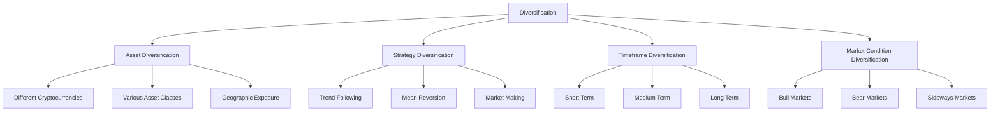
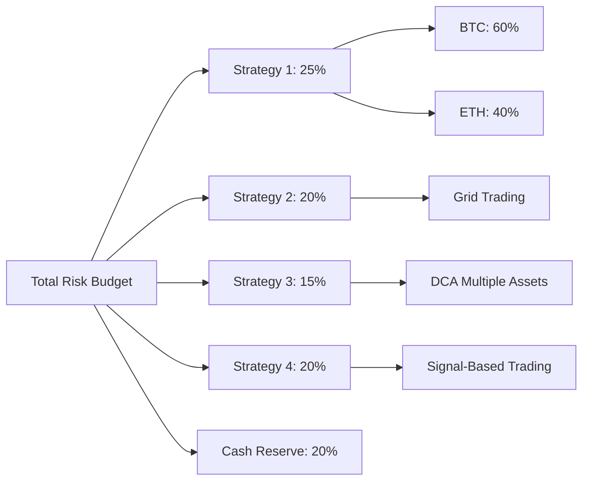
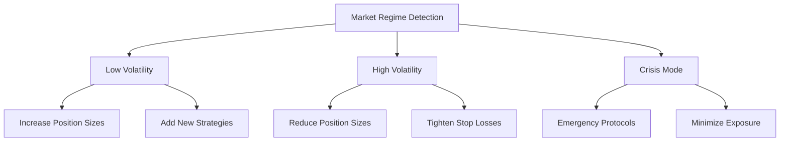

## Introduction to Risk Management

Risk management is the cornerstone of successful automated trading. While generating profits is important, preserving capital and managing downside risk is what separates successful traders from those who blow up their accounts. This guide outlines proven risk management practices for automated trading systems.

<CardGroup cols={2}>
  <Card title="Capital Preservation" icon="shield">
    Protect your trading capital from catastrophic losses
  
</Card>
  <Card title="Risk Measurement" icon="calculator">
    Quantify and monitor various types of risk
  
</Card>
  <Card title="Position Sizing" icon="resize">
    Optimal allocation of capital to trades and strategies
  
</Card>
  <Card title="Portfolio Protection" icon="umbrella">
    Diversification and correlation management
  
</Card>

</CardGroup>

## Fundamental Risk Management Principles

### The 1% Rule

<Warning>
  Never risk more than 1-2% of your total capital on any single trade or
  strategy.

</Warning>

The foundation of risk management is limiting your maximum loss per trade:

- **Individual Trade Risk**: Maximum 1-2% of total portfolio value
- **Strategy Risk**: Maximum 5-10% of total portfolio per strategy
- **Daily Risk Limit**: Maximum 3-5% portfolio loss in a single day
- **Monthly Risk Limit**: Maximum 10-15% portfolio loss in a month

<AccordionGroup>
  <Accordion title="Calculating Position Size">
    ``` Position Size = (Account Balance × Risk %) / Stop Loss Distance Example:
    - Account Balance: $100,000 - Risk per Trade: 1% = $1,000 - Stop Loss: 2%
    from entry - Position Size: $1,000 / 0.02 = $50,000 maximum position ```

</Accordion>

  <Accordion title="Risk-Adjusted Returns">
    Focus on risk-adjusted performance metrics: - **Sharpe Ratio**: (Return -
    Risk-free Rate) / Standard Deviation - **Sortino Ratio**: Return / Downside
    Deviation - **Calmar Ratio**: Annual Return / Maximum Drawdown -
    **Information Ratio**: Excess Return / Tracking Error

</Accordion>

</AccordionGroup>

### Diversification Strategies



<Info>
  Effective diversification reduces portfolio volatility without necessarily
  reducing expected returns.

</Info>

## Position Sizing Methodologies

### Kelly Criterion

The Kelly Criterion provides mathematically optimal position sizing:

<AccordionGroup>
  <Accordion title="Kelly Formula">
    ``` Kelly % = (Win Rate × Average Win) - (Loss Rate × Average Loss) /
    Average Win Example: - Win Rate: 60% (0.6) - Average Win: 4% - Loss Rate:
    40% (0.4) - Average Loss: 2% - Kelly % = (0.6 × 4%) - (0.4 × 2%) / 4% = 1.8%
    ```

</Accordion>

  <Accordion title="Fractional Kelly">
    Most traders use a fraction of Kelly to reduce volatility: - **Quarter Kelly
    (25%)**: Conservative approach - **Half Kelly (50%)**: Balanced approach -
    **Full Kelly (100%)**: Aggressive approach
    <Tip>
      Quarter to Half Kelly typically provides the best risk-adjusted returns
      for most traders.
    
</Tip>

</Accordion>

</AccordionGroup>

### Fixed Percentage Method

Simple but effective position sizing approach:

<CheckList>
  - [ ] **Fixed Risk per Trade**: Always risk same percentage (e.g., 1%) - [ ]
  **Easy to Calculate**: Simple position sizing formula - [ ] **Consistent
  Risk**: Equal risk across all trades - [ ] **Capital Preservation**: Automatic
  position scaling as account grows/shrinks

</CheckList>

### Volatility-Based Sizing

Adjust position sizes based on market volatility:

```json
{
  "volatility_sizing": {
    "base_position_size": 0.02,
    "volatility_lookback": 20,
    "volatility_multiplier": {
      "low_vol": 1.5,
      "normal_vol": 1.0,
      "high_vol": 0.5
    },
    "max_position_size": 0.05,
    "min_position_size": 0.005
  }
}
```

## Stop-Loss Strategies

### Types of Stop-Losses

<AccordionGroup>
  <Accordion title="Fixed Percentage Stops">
    Simple percentage-based exit levels - **Advantages**: Easy to implement,
    consistent risk - **Disadvantages**: Doesn't account for market volatility -
    **Best For**: Stable, low-volatility markets - **Example**: Always exit at
    -2% loss regardless of conditions

</Accordion>

{" "}

<Accordion title="Volatility-Based Stops">
  ATR (Average True Range) based stop placement - **Advantages**: Adapts to
  market conditions - **Disadvantages**: More complex to calculate - **Best
  For**: Varying volatility environments - **Example**: Stop = Entry Price - (2
  × ATR)

</Accordion>

{" "}

<Accordion title="Technical Stops">
  Stops based on technical levels - **Support/Resistance Levels**: Stop below
  support for longs - **Moving Average Stops**: Exit when price crosses MA -
  **Fibonacci Levels**: Stops at key retracement levels - **Chart Pattern
  Stops**: Based on pattern invalidation points

</Accordion>

  <Accordion title="Time-Based Stops">
    Exit positions after predetermined time periods - **Maximum Hold Time**:
    Exit after X days regardless of P&L - **Weekend Exits**: Close positions
    before market close - **Session-Based**: Exit at end of trading sessions -
    **Decay Stops**: Tighten stops as time passes

</Accordion>

</AccordionGroup>

### Dynamic Stop Management

<Warning>
  Never move stops against your position - this violates fundamental risk
  management principles.

</Warning>

Advanced stop-loss techniques:

- **Trailing Stops**: Move stops in your favor as profits increase
- **Breakeven Stops**: Move stop to entry price after predetermined profit
- **Profit Scaling**: Take partial profits and trail remainder
- **Volatility Adjustment**: Adjust stop distance based on changing volatility

## Portfolio-Level Risk Management

### Correlation Management

Monitor and control correlation between positions:

<AccordionGroup>
  <Accordion title="Correlation Monitoring">
    Track correlation between:
    - Individual positions in portfolio
    - Different strategies running simultaneously
    - Portfolio vs overall market (Beta)
    - Cross-asset correlations during stress periods

</Accordion>
  
  <Accordion title="Correlation Limits">
    Set maximum correlation thresholds:
    ```json
    {
      "correlation_limits": {
        "max_position_correlation": 0.7,
        "max_strategy_correlation": 0.5,
        "portfolio_concentration": {
          "max_single_asset": 0.20,
          "max_sector_exposure": 0.30,
          "max_geography": 0.40
        }
      }
    }
    ```

</Accordion>
  
  <Accordion title="Correlation-Based Position Sizing">
    Reduce position sizes when correlations increase:
    - **Low Correlation (< 0.3)**: Full position sizing
    - **Medium Correlation (0.3-0.7)**: Reduce positions by 25-50%
    - **High Correlation (> 0.7)**: Reduce positions by 50-75%
    - **Crisis Correlation (> 0.9)**: Consider position closure

</Accordion>

</AccordionGroup>

### Maximum Drawdown Controls

<Info>
  Drawdown protection is often more important than maximizing returns for
  long-term success.

</Info>

Implement systematic drawdown controls:

<CheckList>
  - [ ] **Portfolio Maximum Drawdown**: 15-20% maximum portfolio decline - [ ]
  **Strategy Drawdown Limits**: 10-15% maximum per strategy - [ ] **Daily Loss
  Limits**: 3-5% maximum daily portfolio loss - [ ] **Risk Scaling**: Reduce
  position sizes during drawdowns - [ ] **Circuit Breakers**: Halt trading
  during extreme conditions

</CheckList>

### Heat Maps and Risk Budgeting

Visualize risk exposure across your portfolio:



## Risk Metrics and Monitoring

### Key Risk Metrics

<AccordionGroup>
  <Accordion title="Value at Risk (VaR)">
    Statistical measure of potential losses - **1-Day VaR**: Expected loss over
    next day - **Confidence Levels**: 95%, 99%, 99.9% - **Calculation Methods**:
    Historical, parametric, Monte Carlo - **Usage**: Daily risk monitoring and
    position sizing

</Accordion>

{" "}

<Accordion title="Expected Shortfall (ES)">
  Average loss beyond VaR threshold - **Also Called**: Conditional VaR (CVaR) -
  **Advantage**: Captures tail risk better than VaR - **Calculation**: Average
  of losses exceeding VaR - **Usage**: Stress testing and extreme risk
  assessment

</Accordion>

  <Accordion title="Maximum Drawdown">
    Largest peak-to-trough decline - **Current Drawdown**: Decline from recent
    high - **Maximum Historical**: Worst decline in backtest/live trading -
    **Recovery Time**: Time to reach new equity highs - **Underwater Periods**:
    Duration of continuous losses

</Accordion>

</AccordionGroup>

### Real-Time Risk Monitoring

Set up comprehensive risk monitoring dashboards:

<Tip>
  Monitor risk metrics in real-time to catch problems before they become
  catastrophic.

</Tip>

**Daily Monitoring Checklist:**

<CheckList>
  - [ ] Current portfolio VaR vs limits - [ ] Individual position sizes vs
  maximums - [ ] Strategy correlation matrix - [ ] Current drawdown vs
  historical maximum - [ ] Cash reserves and margin utilization - [ ] Upcoming
  economic events and market risks

</CheckList>

## Stress Testing and Scenario Analysis

### Historical Stress Tests

Test your portfolio against historical market events:

<AccordionGroup>
  <Accordion title="Crypto Market Crashes">
    - **May 2021 Crash**: 50% BTC decline in days - **June 2022 Terra/Luna
    Collapse**: Broad crypto selloff - **November 2022 FTX Collapse**: Liquidity
    crisis - **March 2020 COVID Crash**: All-asset correlation spike

</Accordion>

  <Accordion title="Traditional Market Events">
    - **2008 Financial Crisis**: Correlation breakdowns - **Flash Crashes**:
    Extreme intraday volatility - **Currency Crises**: Emerging market selloffs
    - **Interest Rate Shocks**: Federal Reserve policy changes

</Accordion>

</AccordionGroup>

### Monte Carlo Simulations

Generate thousands of potential market scenarios:

```json
{
  "monte_carlo_settings": {
    "num_simulations": 10000,
    "time_horizon_days": 252,
    "price_model": "geometric_brownian_motion",
    "volatility_clustering": true,
    "fat_tails": true,
    "correlation_breakdown": {
      "probability": 0.05,
      "spike_level": 0.8
    }
  }
}
```

### Extreme Scenario Planning

Plan for black swan events:

<Warning>
  Always plan for scenarios worse than your historical data suggests is
  possible.

</Warning>

- **80% Portfolio Decline**: Can you survive and recover?
- **Extended Bear Market**: 2+ years of negative returns
- **Liquidity Crisis**: Unable to exit positions quickly
- **Exchange Failure**: Loss of access to trading platforms
- **Regulatory Changes**: Sudden trading restrictions

## Psychology and Behavioral Risk Management

### Emotional Discipline

<AccordionGroup>
  <Accordion title="Fear and Greed Management">
    Control emotional responses to market moves - **Fear of Missing Out
    (FOMO)**: Stick to predetermined position sizes - **Revenge Trading**: Never
    increase size after losses - **Overconfidence**: Maintain consistent risk
    after winning streaks - **Analysis Paralysis**: Set decision deadlines and
    stick to them

</Accordion>

  <Accordion title="Systematic Approach">
    Remove emotions through systematization - **Pre-defined Rules**: Clear
    entry, exit, and sizing rules - **Automated Execution**: Reduce human
    intervention - **Regular Reviews**: Scheduled performance analysis -
    **Journaling**: Track decisions and emotional states

</Accordion>

</AccordionGroup>

### Cognitive Biases

Recognize and mitigate common trading biases:

<CheckList>
  - [ ] **Confirmation Bias**: Seeking information that confirms existing
  beliefs - [ ] **Anchoring**: Over-relying on first piece of information - [ ]
  **Recency Bias**: Overweighting recent events - [ ] **Overconfidence**:
  Overestimating accuracy of predictions - [ ] **Loss Aversion**: Taking
  excessive risk to avoid realizing losses

</CheckList>

## Risk Management Implementation

### Setting Up Risk Controls

<AccordionGroup>
  <Accordion title="Account-Level Controls">
    ```json
    {
      "account_risk_limits": {
        "max_daily_loss_pct": 5.0,
        "max_monthly_loss_pct": 15.0,
        "max_portfolio_leverage": 2.0,
        "min_cash_reserve_pct": 10.0,
        "max_single_position_pct": 20.0
      }
    }
    ```

</Accordion>
  
  <Accordion title="Strategy-Level Controls">
    ```json
    {
      "strategy_risk_limits": {
        "max_strategy_allocation_pct": 25.0,
        "max_strategy_drawdown_pct": 10.0,
        "max_correlation_with_others": 0.7,
        "min_sharpe_ratio": 0.5,
        "max_trades_per_day": 10
      }
    }
    ```

</Accordion>
  
  <Accordion title="Position-Level Controls">
    ```json
    {
      "position_risk_limits": {
        "max_position_risk_pct": 2.0,
        "max_position_size_usd": 50000,
        "min_risk_reward_ratio": 1.5,
        "max_holding_period_days": 30,
        "required_stop_loss": true
      }
    }
    ```

</Accordion>

</AccordionGroup>

### Risk Reporting and Alerts

Set up comprehensive risk reporting:

<Info>
  Automate risk reporting to ensure consistent monitoring and quick response to
  risk events.

</Info>

**Risk Alert Triggers:**

- VaR exceeds 95% of daily limit
- Portfolio correlation spikes above 0.8
- Strategy drawdown exceeds 7.5%
- Cash reserves fall below 5%
- Any position exceeds maximum size
- Daily loss approaches monthly limit

## Advanced Risk Management Topics

### Liquidity Risk Management

<AccordionGroup>
  <Accordion title="Liquidity Assessment">
    Evaluate liquidity for each position - **Average Daily Volume**: Minimum 10x
    position size - **Bid-Ask Spreads**: Monitor trading costs - **Market
    Depth**: Ability to exit without major impact - **Historical Liquidity**:
    Performance during stress periods

</Accordion>

  <Accordion title="Liquidity Stress Testing">
    Test portfolio under liquidity constraints - **Reduced Volume Scenarios**:
    50% normal volume - **Wider Spreads**: 2-5x normal bid-ask spreads -
    **Market Gapping**: Inability to execute at expected prices - **Exchange
    Outages**: Temporary inability to trade

</Accordion>

</AccordionGroup>

### Dynamic Risk Budgeting

Adjust risk based on market conditions:



### Multi-Timeframe Risk Management

Consider risks across different timeframes:

- **Intraday Risk**: High-frequency position management
- **Daily Risk**: Overnight exposure and gap risk
- **Weekly Risk**: Weekend and news event exposure
- **Monthly Risk**: Longer-term trend and cycle risks
- **Annual Risk**: Strategic allocation and rebalancing

## Risk Management Checklist

### Daily Risk Management

<CheckList>
  - [ ] Review current portfolio VaR - [ ] Check position sizes vs limits - [ ]
  Monitor correlation matrix - [ ] Verify stop-loss levels - [ ] Assess cash
  reserves - [ ] Review upcoming market events

</CheckList>

### Weekly Risk Management

<CheckList>
  - [ ] Analyze portfolio performance attribution - [ ] Review strategy
  correlations - [ ] Update volatility estimates - [ ] Stress test current
  positions - [ ] Evaluate risk-adjusted returns - [ ] Plan for upcoming
  economic events

</CheckList>

### Monthly Risk Management

<CheckList>
  - [ ] Comprehensive performance review - [ ] Risk model validation - [ ]
  Strategy optimization analysis - [ ] Benchmark comparison - [ ] Risk limit
  effectiveness review - [ ] Update risk management procedures

</CheckList>

## Next Steps

<CardGroup cols={2}>
  <Card
    title="Risk Management Tools"
    href="/portfolio/risk-management-tools"
    icon="tools"
  >
    Explore Hyperscript's risk management features
  
</Card>
  <Card
    title="Strategy Building Guide"
    href="/guides/strategy-building"
    icon="hammer"
  >
    Learn to incorporate risk management into strategies
  
</Card>
  <Card
    title="Portfolio Dashboard"
    href="/portfolio/dashboard"
    icon="chart-mixed"
  >
    Monitor risk in real-time
  
</Card>
  <Card
    title="Performance Analytics"
    href="/portfolio/performance-analytics"
    icon="chart-line"
  >
    Analyze risk-adjusted performance
  
</Card>

</CardGroup>{" "}
