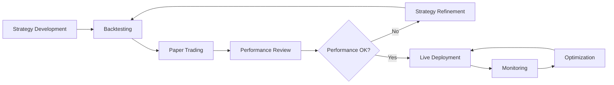

## Introduction to Strategy Building

Building effective automated trading strategies requires a combination of market understanding, technical analysis, risk management, and systematic testing. This guide walks you through the complete process of creating custom strategies in Hyperscript.

<CardGroup cols={2}>
  <Card title="Strategy Fundamentals" icon="foundation">
    Core concepts and principles of strategy design
  </Card>
  <Card title="Technical Implementation" icon="code">
    Practical steps to build and deploy strategies
  </Card>
  <Card title="Optimization Techniques" icon="sliders">
    Methods to improve strategy performance
  </Card>
  <Card title="Risk Integration" icon="shield-check">
    Incorporating risk management into strategies
  </Card>
</CardGroup>

## Strategy Development Process

### Phase 1: Strategy Conceptualization

<AccordionGroup>
  <Accordion title="Market Hypothesis">
    Define your core market belief or edge - **Trend Following**: Markets
    exhibit momentum that can be captured - **Mean Reversion**: Prices tend to
    return to historical averages - **Arbitrage**: Price differences exist
    between related assets - **Market Making**: Provide liquidity to capture
    bid-ask spreads - **Event-Driven**: React to specific market events or
    announcements
</Accordion>

{" "}
<Accordion title="Strategy Classification">
  Choose your strategy type and timeframe ```mermaid graph TD A[Strategy Types]
  --> B[Trend Following] A --> C[Mean Reversion] A --> D[Market Making] A -->
  E[Arbitrage] B --> B1[Momentum] B --> B2[Breakout] B --> B3[Moving Average] C
  --> C1[RSI Based] C --> C2[Bollinger Bands] C --> C3[Support/Resistance] D -->
  D1[Grid Trading] D --> D2[Order Book] E --> E1[Statistical Arbitrage] E -->
  E2[Cross-Exchange] ```
</Accordion>

  <Accordion title="Asset Selection">
    Choose appropriate assets for your strategy - **Liquidity Requirements**:
    Ensure sufficient trading volume - **Volatility Preferences**: Match
    strategy to volatility characteristics - **Correlation Analysis**: Consider
    relationships between assets - **Market Hours**: Account for trading session
    overlaps - **Fundamental Factors**: Include macro and news considerations
</Accordion>
</AccordionGroup>

### Phase 2: Technical Specification

<Info>
  Before implementing, clearly define your strategy's entry, exit, and risk
  management rules.
</Info>

#### Entry Conditions

Define precise conditions for entering positions:

<CheckList>
  - [ ] **Signal Generation**: What triggers a trade signal? - [ ]
  **Confirmation Requirements**: Additional filters to validate signals - [ ]
  **Timing Constraints**: When during the day/week to trade - [ ] **Market
  Condition Filters**: Bull/bear/sideways market adaptations - [ ]
  **Volume/Liquidity Checks**: Minimum volume requirements
</CheckList>

#### Exit Conditions

<AccordionGroup>
  <Accordion title="Profit Taking">
    Methods to lock in profits - **Fixed Targets**: Predetermined price levels -
    **Trailing Stops**: Dynamic exit following price movements - **Time-Based
    Exits**: Maximum holding periods - **Signal Reversal**: Exit when opposite
    signal appears - **Volatility-Based**: Exit based on market volatility
    changes
</Accordion>

  <Accordion title="Loss Management">
    Protecting capital from adverse moves - **Stop Loss Orders**: Fixed
    percentage or dollar amount losses - **Maximum Adverse Excursion**: Limit
    maximum unrealized losses - **Portfolio Heat**: Limit total portfolio risk
    exposure - **Correlation Stops**: Exit when asset correlations change -
    **Time Stops**: Exit after predetermined time periods
</Accordion>
</AccordionGroup>

## Implementation in Hyperscript

### Using the Strategy Builder

<Warning>
  Always start with paper trading to validate your strategy before risking real
  capital.
</Warning>

#### Step 1: Strategy Setup

1. **Navigate to Strategy Builder** in your Hyperscript dashboard
2. **Select Strategy Template** based on your chosen approach
3. **Configure Basic Parameters**:
   - Strategy name and description
   - Asset selection (single or multi-asset)
   - Base timeframe for signals
   - Initial capital allocation

#### Step 2: Signal Configuration

<AccordionGroup>
  <Accordion title="Technical Indicators">
    Configure technical analysis components
    ```json
    {
      "indicators": {
        "sma_20": {
          "type": "simple_moving_average",
          "period": 20
        },
        "rsi_14": {
          "type": "rsi",
          "period": 14,
          "overbought": 70,
          "oversold": 30
        },
        "bb_20": {
          "type": "bollinger_bands",
          "period": 20,
          "std_dev": 2
        }
      }
    }
    ```
</Accordion>
  
  <Accordion title="Entry Logic">
    Define entry conditions using logical operators
    ```json
    {
      "entry_conditions": {
        "long": {
          "operator": "AND",
          "conditions": [
            {"indicator": "price", "operator": ">", "value": "sma_20"},
            {"indicator": "rsi_14", "operator": "<", "value": 70},
            {"indicator": "volume", "operator": ">", "value": "volume_sma_10"}
          ]
        },
        "short": {
          "operator": "AND", 
          "conditions": [
            {"indicator": "price", "operator": "<", "value": "sma_20"},
            {"indicator": "rsi_14", "operator": ">", "value": 30}
          ]
        }
      }
    }
    ```
</Accordion>
  
  <Accordion title="Exit Logic">
    Configure exit conditions and risk management
    ```json
    {
      "exit_conditions": {
        "take_profit": {
          "type": "percentage",
          "value": 0.05
        },
        "stop_loss": {
          "type": "percentage", 
          "value": 0.02
        },
        "trailing_stop": {
          "type": "percentage",
          "value": 0.01,
          "activation_profit": 0.02
        }
      }
    }
    ```
</Accordion>
</AccordionGroup>

### Advanced Strategy Features

#### Position Sizing Rules

<Tip>
  Proper position sizing is crucial for long-term strategy success and risk
  management.
</Tip>

```json
{
  "position_sizing": {
    "method": "kelly_criterion",
    "parameters": {
      "max_position_size": 0.1,
      "min_position_size": 0.01,
      "win_rate": 0.55,
      "avg_win_loss_ratio": 1.5,
      "kelly_fraction": 0.25
    }
  }
}
```

#### Dynamic Parameter Adjustment

<AccordionGroup>
  <Accordion title="Market Regime Detection">
    Adjust strategy parameters based on market conditions - **Volatility
    Regimes**: Different parameters for high/low volatility - **Trend
    Identification**: Adapt to trending vs sideways markets - **Volume
    Analysis**: Modify behavior based on market participation - **Correlation
    Monitoring**: Adjust when correlations break down
</Accordion>

  <Accordion title="Performance-Based Adjustments">
    Modify strategy based on recent performance - **Drawdown Management**:
    Reduce position sizes during drawdowns - **Winning Streak Handling**: Manage
    risk during hot streaks - **Signal Quality Assessment**: Adjust based on
    signal accuracy - **Market Impact Consideration**: Reduce size if moving
    markets
</Accordion>
</AccordionGroup>

## Strategy Testing and Validation

### Backtesting Framework

<Info>
  Comprehensive backtesting helps validate strategy effectiveness before live
  deployment.
</Info>

#### Historical Data Analysis

<CheckList>
  - [ ] **Data Quality**: Ensure clean, accurate historical data - [ ] **Time
  Period Selection**: Test across multiple market cycles - [ ] **Walk-Forward
  Analysis**: Progressive testing methodology - [ ] **Out-of-Sample Testing**:
  Reserve data for final validation - [ ] **Survivorship Bias**: Account for
  delisted assets
</CheckList>

#### Performance Metrics

<AccordionGroup>
  <Accordion title="Return Metrics">
    - **Total Return**: Absolute and percentage gains - **Compound Annual Growth
    Rate (CAGR)** - **Risk-Adjusted Returns (Sharpe, Sortino Ratios)** -
    **Maximum Drawdown and Recovery Time** - **Win Rate and Profit Factor**
</Accordion>

{" "}
<Accordion title="Risk Metrics">
  - **Value at Risk (VaR)** at different confidence levels - **Expected
  Shortfall** (Conditional VaR) - **Beta vs Market** correlation and systematic
  risk - **Standard Deviation** of returns - **Skewness and Kurtosis** of return
  distribution
</Accordion>

  <Accordion title="Trade-Level Analysis">
    - **Average Trade Duration** and holding periods - **Trade Frequency** and
    turnover analysis - **Slippage and Transaction Cost** impact - **Market
    Impact** of strategy trades - **Capacity Analysis** for strategy scalability
</Accordion>
</AccordionGroup>

### Paper Trading Validation

Before live deployment, test your strategy in paper trading mode:



<Warning>
  Paper trading should simulate real-world conditions including slippage,
  latency, and market impact.
</Warning>

## Strategy Optimization Techniques

### Parameter Optimization

<AccordionGroup>
  <Accordion title="Grid Search">
    Systematic testing of parameter combinations - **Exhaustive Search**: Test
    all possible combinations - **Computational Efficiency**: Balance
    thoroughness with speed - **Cross-Validation**: Validate results across
    different periods - **Overfitting Prevention**: Avoid excessive parameter
    tuning
</Accordion>

{" "}
<Accordion title="Genetic Algorithms">
  Evolutionary approach to parameter optimization - **Population-Based Search**:
  Multiple parameter sets evolve - **Fitness Function**: Define optimization
  objectives - **Mutation and Crossover**: Create new parameter combinations -
  **Convergence Criteria**: Determine when optimization is complete
</Accordion>

  <Accordion title="Bayesian Optimization">
    Probabilistic approach to parameter tuning - **Prior Distributions**:
    Incorporate domain knowledge - **Acquisition Functions**: Efficiently
    explore parameter space - **Uncertainty Quantification**: Account for
    parameter uncertainty - **Sequential Design**: Iteratively improve parameter
    estimates
</Accordion>
</AccordionGroup>

### Multi-Objective Optimization

Balance competing objectives in strategy design:

<Tip>
  Consider multiple objectives like return, risk, and drawdown rather than
  optimizing for returns alone.
</Tip>

1. **Return Maximization** vs **Risk Minimization**
2. **Profit Factor** vs **Maximum Drawdown**
3. **Win Rate** vs **Average Win Size**
4. **Strategy Capacity** vs **Alpha Generation**
5. **Simplicity** vs **Performance**

## Risk Management Integration

### Portfolio-Level Risk Controls

<AccordionGroup>
  <Accordion title="Position Sizing">
    Determine appropriate position sizes for each trade - **Kelly Criterion**:
    Optimal bet sizing based on edge - **Risk Parity**: Equal risk contribution
    from each position - **Volatility Scaling**: Size inversely proportional to
    volatility - **Maximum Risk per Trade**: Fixed percentage limits
</Accordion>

{" "}
<Accordion title="Correlation Management">
  Monitor and control correlation between strategies - **Maximum Correlation
  Limits**: Prevent concentration risk - **Dynamic Correlation Monitoring**:
  Track changing relationships - **Diversification Requirements**: Maintain
  portfolio balance - **Risk Budget Allocation**: Distribute risk across
  strategies
</Accordion>

  <Accordion title="Drawdown Controls">
    Protect against significant losses - **Maximum Drawdown Limits**: Portfolio
    and strategy level - **Risk Scaling**: Reduce size during drawdown periods -
    **Circuit Breakers**: Halt trading during extreme conditions - **Recovery
    Protocols**: Structured re-entry procedures
</Accordion>
</AccordionGroup>

## Common Strategy Patterns

### Trend Following Strategies

<AccordionGroup>
  <Accordion title="Moving Average Crossover">
    ```json
    {
      "strategy_type": "trend_following",
      "signals": {
        "long_entry": "fast_ma > slow_ma",
        "short_entry": "fast_ma < slow_ma",
        "exit": "signal_reversal"
      },
      "parameters": {
        "fast_period": 10,
        "slow_period": 20,
        "confirmation_bars": 2
      }
    }
    ```
</Accordion>
  
  <Accordion title="Breakout Strategy">
    ```json
    {
      "strategy_type": "breakout",
      "signals": {
        "long_entry": "close > resistance_level",
        "short_entry": "close < support_level", 
        "exit": "return_to_range"
      },
      "parameters": {
        "lookback_period": 20,
        "breakout_threshold": 0.02,
        "volume_confirmation": true
      }
    }
    ```
</Accordion>
</AccordionGroup>

### Mean Reversion Strategies

<AccordionGroup>
  <Accordion title="RSI Mean Reversion">
    ```json
    {
      "strategy_type": "mean_reversion",
      "signals": {
        "long_entry": "rsi < oversold_level",
        "short_entry": "rsi > overbought_level",
        "exit": "rsi_return_to_neutral"
      },
      "parameters": {
        "rsi_period": 14,
        "oversold_level": 30,
        "overbought_level": 70
      }
    }
    ```
</Accordion>
  
  <Accordion title="Bollinger Band Reversal">
    ```json
    {
      "strategy_type": "mean_reversion",
      "signals": {
        "long_entry": "close < lower_band",
        "short_entry": "close > upper_band",
        "exit": "close_crosses_middle_band"
      },
      "parameters": {
        "bb_period": 20,
        "bb_std_dev": 2,
        "rsi_filter": true
      }
    }
    ```
</Accordion>
</AccordionGroup>

## Strategy Monitoring and Maintenance

### Performance Monitoring

<CheckList>
  - [ ] Daily P&L tracking and analysis - [ ] Strategy vs benchmark comparison -
  [ ] Risk metric monitoring (VaR, drawdown) - [ ] Signal quality assessment - [
  ] Market regime change detection - [ ] Correlation monitoring with other
  strategies - [ ] Transaction cost analysis - [ ] Capacity utilization tracking
</CheckList>

### Maintenance Schedule

<AccordionGroup>
  <Accordion title="Daily Reviews">
    - Performance vs expectations check - Risk limit compliance verification -
    Signal generation quality assessment - Market condition changes evaluation
</Accordion>

{" "}
<Accordion title="Weekly Analysis">
  - Detailed performance attribution - Parameter drift detection - Correlation
  matrix updates - Risk-adjusted return analysis
</Accordion>

  <Accordion title="Monthly Optimization">
    - Strategy parameter review - Market regime analysis - Benchmark comparison
    study - Capacity and scalability assessment
</Accordion>
</AccordionGroup>

## Advanced Topics

### Machine Learning Integration

<Info>
  Incorporate ML techniques to enhance traditional strategies with adaptive and
  predictive capabilities.
</Info>

<AccordionGroup>
  <Accordion title="Feature Engineering">
    - **Technical Indicators**: Traditional and custom indicators - **Market
    Microstructure**: Order book and trade data - **Alternative Data**:
    Sentiment, news, social media - **Cross-Asset Features**: Correlations and
    spreads
</Accordion>

{" "}
<Accordion title="Model Selection">
  - **Classification**: Signal generation (buy/sell/hold) - **Regression**:
  Price target prediction - **Clustering**: Market regime identification -
  **Reinforcement Learning**: Adaptive strategy optimization
</Accordion>

  <Accordion title="Implementation Considerations">
    - **Data Leakage Prevention**: Proper train/test splitting - **Feature
    Importance**: Understanding model drivers - **Model Stability**: Robustness
    across market conditions - **Online Learning**: Adaptive model updating
</Accordion>
</AccordionGroup>

## Next Steps

<CardGroup cols={2}>
  <Card
    title="Risk Management Best Practices"
    href="/guides/risk-management-best-practices"
    icon="shield-check"
  >
    Learn advanced risk management techniques
  </Card>
  <Card
    title="Backtesting Engine"
    href="/advanced/backtesting-engine"
    icon="clock-rotate-left"
  >
    Test your strategies with historical data
  </Card>
  <Card
    title="Market Analysis Guide"
    href="/guides/market-analysis"
    icon="chart-line"
  >
    Understand market dynamics for better strategies
  </Card>
  <Card
    title="Trading Wizard"
    href="/trading-strategies/trading-wizard"
    icon="magic-wand"
  >
    Get AI-powered strategy recommendations
  </Card>
</CardGroup>{" "}
