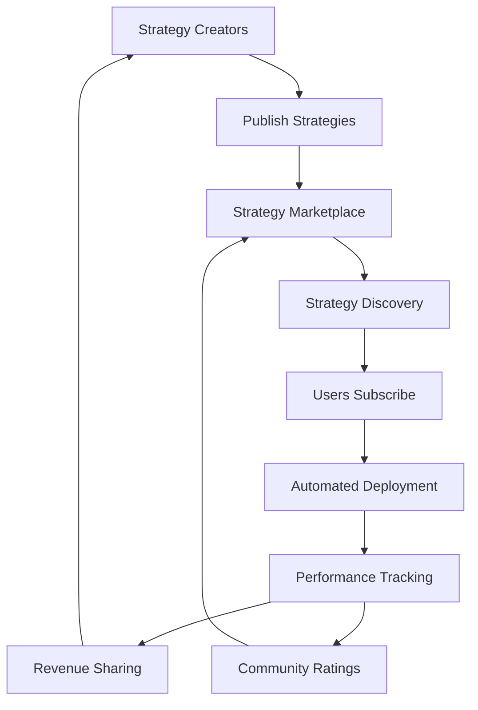

## What is the Strategy Marketplace?

The Nimbus Strategy Marketplace is a community-driven platform where traders can discover proven strategies, share their own successful bots, and monetize their trading expertise. It creates a collaborative ecosystem where knowledge and profits are shared among community members.

## How the Marketplace Works

The marketplace connects strategy creators with users looking for profitable automated trading solutions:

<Info>
  **Example Flow**: 1. **Creator** develops and tests a profitable grid trading
  strategy 2. **Creator** publishes strategy to marketplace with performance
  history 3. **Users** discover strategy, review backtests and live performance
  4. **Users** subscribe and deploy strategy with their capital 5. **Creator**
  earns revenue share from subscriber profits 6. **Community** benefits from
  shared knowledge and improved strategies

</Info>

### Marketplace Ecosystem



## Discovering Strategies

### Browse Strategy Categories

Find strategies organized by type and trading approach:

<CardGroup cols={2}>
<Card title="Conservative Strategies" icon="shield-check">
**Low-risk, steady returns:**
- Portfolio rebalancing bots
- Conservative DCA strategies
- Low-volatility grid trading
- Yield farming optimizers

</Card>

<Card title="Growth Strategies" icon="chart-line-up">
  **Moderate risk, higher returns:** - Momentum-based trading - Trend following
  systems - Multi-timeframe strategies - Signal-enhanced approaches

</Card>

<Card title="Advanced Strategies" icon="brain">
  **Sophisticated approaches:** - Multi-asset arbitrage - Market making
  strategies - Volatility trading - Complex signal combinations

</Card>

<Card title="Niche Strategies" icon="bullseye">
**Specialized approaches:**
- Event-driven trading
- Seasonal strategies
- Cross-chain arbitrage
- DeFi yield strategies

</Card>

</CardGroup>

### Strategy Search & Filtering

Find exactly what you're looking for with powerful search tools:

<AccordionGroup>
<Accordion icon="search" title="Advanced Search Filters">
**Filter strategies by multiple criteria:**

```javascript
Search Filters:
├── Performance Metrics:
│   ├── Minimum Return: 15% annually
│   ├── Maximum Drawdown: <10%
│   ├── Sharpe Ratio: >1.0
│   └── Win Rate: >60%
├── Strategy Characteristics:
│   ├── Asset Class: [ETH, BTC, SOL, Multi-asset]
│   ├── Strategy Type: [Grid, DCA, Signal, Rebalancing]
│   ├── Risk Level: [Low, Medium, High]
│   └── Complexity: [Beginner, Intermediate, Advanced]
├── Market Conditions:
│   ├── Best Performance: [Bull, Bear, Sideways]
│   ├── Volatility Preference: [Low, Medium, High]
│   └── Market Cap Focus: [Large, Mid, Small cap]
└── Practical Considerations:
    ├── Minimum Capital: $100 - $10,000+
    ├── Time Commitment: [Passive, Semi-active, Active]
    ├── Creator Rating: 4+ stars
    └── Subscription Cost: <$50/month
```

</Accordion>

<Accordion icon="star" title="Community Ratings & Reviews">
**Learn from other users' experiences:**

- **Overall Rating**: 1-5 star community rating
- **Performance Rating**: How well strategy performs vs expectations
- **Ease of Use**: Setup and management difficulty
- **Creator Support**: Responsiveness and helpfulness
- **Written Reviews**: Detailed user experiences and tips
- **Performance Comments**: Real user results and modifications

</Accordion>

</AccordionGroup>

## Strategy Information & Analysis

### Comprehensive Strategy Profiles

Each strategy includes detailed information to help you make informed decisions:

<AccordionGroup>
<Accordion icon="chart-line" title="Performance Analytics">
**Complete performance history and statistics:**

```javascript
Strategy Performance Profile:
├── Live Performance (6 months):
│   ├── Total Return: 22.4%
│   ├── Annualized Return: 44.8%
│   ├── Sharpe Ratio: 1.35
│   ├── Maximum Drawdown: -7.2%
│   ├── Win Rate: 64%
│   └── Profit Factor: 1.8
├── Backtest Results (2 years):
│   ├── Total Return: 89.3%
│   ├── Annualized Return: 37.2%
│   ├── Maximum Drawdown: -12.1%
│   ├── Calmar Ratio: 3.07
│   └── Total Trades: 1,247
├── Risk Metrics:
│   ├── Volatility: 28.3% annual
│   ├── Value at Risk (95%): -2.1%
│   ├── Expected Shortfall: -3.4%
│   └── Beta vs ETH: 0.73
└── Market Regime Performance:
    ├── Bull Markets: +45.2%
    ├── Bear Markets: -8.7%
    ├── Sideways Markets: +12.4%
    └── High Volatility: +8.9%
```

</Accordion>

<Accordion icon="gear" title="Strategy Configuration">
**Technical details and implementation:**

- **Strategy Type**: Grid Trading with Signal Enhancement
- **Assets Traded**: ETH/USDC primary, BTC/USDC secondary
- **Trading Frequency**: 2-5 trades per day
- **Capital Requirements**: Minimum $500, recommended $2,000+
- **Risk Management**: Built-in stop losses and position limits
- **Customization Options**: Adjustable risk levels and position sizing
- **Dependencies**: Requires Nimbus signal access
- **Update Frequency**: Strategy parameters updated monthly

</Accordion>

<Accordion icon="user" title="Creator Information">
**Learn about the strategy creator:**

- **Creator Name**: @CryptoGridMaster
- **Marketplace Rating**: 4.8/5 (127 reviews)
- **Trading Experience**: 5+ years DeFi, 3+ years automated
- **Strategy Count**: 8 published strategies
- **Total Subscribers**: 342 active subscribers
- **Creator Bio**: Former traditional finance, specialized in volatility strategies
- **Verification Status**: Verified creator with track record
- **Response Time**: Typically responds within 24 hours

</Accordion>

</AccordionGroup>

### Live Performance Tracking

Monitor real-time strategy performance from actual subscribers:

<CardGroup cols={3}>
<Card title="Aggregate Performance" icon="chart-area">
Performance across all subscribers using the strategy

</Card>

<Card title="Individual Results" icon="users">
  Anonymized individual subscriber performance ranges

</Card>

<Card title="Recent Activity" icon="activity">
Latest trades, adjustments, and performance updates

</Card>

</CardGroup>

## Subscribing to Strategies

### Subscription Models

Choose the subscription model that works best for you:

<AccordionGroup>
<Accordion icon="credit-card" title="Subscription Types">
**Flexible subscription options:**

```javascript
Subscription Models:
├── Performance Fee Model:
│   ├── Setup Fee: $0
│   ├── Monthly Fee: $0
│   ├── Performance Fee: 20% of profits
│   ├── High Water Mark: Yes
│   └── Best For: Performance-focused users
├── Monthly Subscription:
│   ├── Setup Fee: $0
│   ├── Monthly Fee: $49
│   ├── Performance Fee: 0%
│   ├── Cancellation: Anytime
│   └── Best For: Consistent cost preference
├── One-Time Purchase:
│   ├── Setup Fee: $299
│   ├── Monthly Fee: $0
│   ├── Performance Fee: 0%
│   ├── Lifetime Access: Yes
│   └── Best For: Long-term strategy users
└── Freemium Model:
    ├── Setup Fee: $0
    ├── Monthly Fee: $0
    ├── Performance Fee: 30% of profits
    ├── Limited Features: Yes
    └── Best For: Testing and small accounts
```

</Accordion>

<Accordion icon="shield-check" title="Subscriber Protection">
**Built-in protections for subscribers:**

- **30-Day Money Back**: Full refund if unsatisfied (monthly subscriptions)
- **Performance Guarantees**: Some strategies offer performance minimums
- **Dispute Resolution**: Mediated resolution for subscription issues
- **Creator Accountability**: Regular performance reviews and standards
- **Strategy Versioning**: Access to strategy updates and improvements
- **Risk Disclosure**: Clear risk warnings and historical drawdowns

</Accordion>

</AccordionGroup>

### Deployment Process

Simple process to start using a marketplace strategy:

<AccordionGroup>
<Accordion icon="rocket" title="Strategy Deployment">
**Get started in minutes:**

1. **Subscribe to Strategy**: Choose subscription model and confirm
2. **Configure Parameters**: Customize risk level and position sizing
3. **Allocate Capital**: Set how much capital to deploy
4. **Review Settings**: Confirm all parameters and risk controls
5. **Deploy Strategy**: Activate automated trading
6. **Monitor Performance**: Track results and receive updates

```javascript
Deployment Configuration:
├── Strategy: "ETH Grid Master Pro"
├── Subscription: "Performance Fee (20%)"
├── Capital Allocation: $2,500
├── Risk Level: "Medium"
├── Position Size: "2% per trade"
├── Stop Loss: "Enabled (5%)"
├── Max Drawdown: "10%"
└── Notifications: "All alerts enabled"
```

</Accordion>

<Accordion icon="sliders" title="Customization Options">
**Adapt strategies to your preferences:**

- **Risk Level Adjustment**: Scale strategy risk up or down
- **Position Sizing**: Modify trade sizes for your capital
- **Asset Selection**: Choose which assets to trade (if applicable)
- **Time Restrictions**: Set trading hours and blackout periods
- **Additional Filters**: Add your own risk management rules
- **Notification Preferences**: Customize alert settings

</Accordion>

</AccordionGroup>

## Creating & Publishing Strategies

### Becoming a Strategy Creator

Share your successful strategies and earn revenue from the community:

<AccordionGroup>
<Accordion icon="user-plus" title="Creator Requirements">
**Qualifications to publish strategies:**

<CheckList>
  - Verified Nimbus account (3+ months) - Demonstrated trading performance
  (6+ months live results) - Strategy backtesting results (minimum 12 months) -
  Community guidelines agreement - Technical documentation completion - Risk
  disclosure statements - Responsive customer support commitment

</CheckList>

</Accordion>

<Accordion icon="upload" title="Strategy Publishing Process">
**Step-by-step publishing workflow:**

1. **Strategy Development**: Create and test your strategy thoroughly
2. **Performance Documentation**: Compile backtests and live results
3. **Creator Application**: Apply for creator status with credentials
4. **Strategy Submission**: Submit strategy with full documentation
5. **Review Process**: Nimbus team reviews for quality and compliance
6. **Community Preview**: Limited release for community feedback
7. **Full Publication**: Strategy goes live in marketplace
8. **Ongoing Support**: Provide subscriber support and updates

**Review Criteria**:

- Strategy originality and effectiveness
- Risk management implementation
- Documentation quality and completeness
- Creator background and expertise
- Community benefit and education value

</Accordion>

</AccordionGroup>

### Revenue Sharing Model

Earn income from your trading expertise:

<CardGroup cols={2}>
<Card title="Creator Revenue Share" icon="dollar-sign">
**Earn from subscriber success:**
- Performance fees: Keep 70% of performance fees
- Monthly subscriptions: Keep 80% of monthly fees
- One-time purchases: Keep 85% of purchase price
- Bonus incentives: Extra rewards for top performers

</Card>

<Card title="Performance Incentives" icon="trophy">
**Rewards for excellence:**
- Top strategy bonuses (monthly)
- Creator of the month recognition
- Exclusive creator benefits
- Advanced analytics access
- Priority platform features
- Marketing support

</Card>

</CardGroup>

## Community Features

### Strategy Discussion & Support

Engage with creators and fellow subscribers:

<AccordionGroup>
<Accordion icon="comments" title="Strategy Forums">
**Dedicated discussion spaces for each strategy:**

- **General Discussion**: Strategy questions and experiences
- **Performance Analysis**: Sharing results and optimizations
- **Parameter Tuning**: Community-driven improvements
- **Market Commentary**: How strategy performs in current conditions
- **Creator Q&A**: Direct interaction with strategy creators
- **Modification Sharing**: User customizations and variations

</Accordion>

<Accordion icon="graduation-cap" title="Educational Content">
**Learn from strategy creators:**

- **Strategy Tutorials**: Step-by-step implementation guides
- **Market Analysis**: Creator insights on market conditions
- **Risk Management**: Best practices for strategy deployment
- **Performance Reviews**: Regular strategy analysis and updates
- **Live Sessions**: Q&A sessions with creators
- **Case Studies**: Detailed analysis of successful implementations

</Accordion>

</AccordionGroup>

### Community Ratings & Reviews

Transparent feedback system for strategies and creators:

<CardGroup cols={2}>
<Card title="Strategy Reviews" icon="star">
**Comprehensive rating system:**
- Overall performance rating
- Ease of use and setup
- Risk management quality
- Documentation completeness
- Creator responsiveness
- Value for money

</Card>

<Card title="Creator Reputation" icon="award">
**Build and maintain creator credibility:**
- Overall creator rating
- Response time metrics
- Strategy success rate
- Community engagement level
- Long-term track record
- Dispute resolution history

</Card>

</CardGroup>

## Marketplace Analytics

### Performance Tracking

Monitor marketplace-wide statistics and trends:

<AccordionGroup>
<Accordion icon="chart-bar" title="Marketplace Statistics">
**Comprehensive marketplace analytics:**

```javascript
Marketplace Analytics Dashboard:
├── Strategy Performance:
│   ├── Total Strategies: 847
│   ├── Active Strategies: 623
│   ├── Average Return: 18.7% annually
│   ├── Top Performing: 94.2% annually
│   └── Success Rate: 73% profitable
├── Creator Statistics:
│   ├── Total Creators: 156
│   ├── Active Creators: 98
│   ├── Average Creator Rating: 4.2/5
│   ├── Top Creator Return: 127% annually
│   └── Creator Retention: 89%
├── Subscriber Metrics:
│   ├── Total Subscribers: 12,847
│   ├── Active Subscriptions: 8,934
│   ├── Average Capital Deployed: $3,247
│   ├── Subscriber Satisfaction: 4.6/5
│   └── Subscription Renewal Rate: 78%
└── Market Trends:
    ├── Most Popular Category: Grid Trading
    ├── Fastest Growing: Signal-Based Strategies
    ├── Highest ROI Category: Advanced Strategies
    └── Most Stable: Conservative Strategies
```

</Accordion>

<Accordion icon="trending-up" title="Performance Leaderboards">
**Track top-performing strategies and creators:**

- **Top Strategies by Return**: Best performing strategies (various timeframes)
- **Top Strategies by Sharpe Ratio**: Best risk-adjusted performance
- **Most Consistent Strategies**: Lowest volatility and drawdown
- **Most Popular Strategies**: Highest subscriber counts
- **Rising Stars**: Newest strategies with strong performance
- **Creator Leaderboards**: Top creators by various metrics

</Accordion>

</AccordionGroup>

## Quality Assurance & Safety

### Strategy Verification

Ensuring marketplace quality and subscriber safety:

<AccordionGroup>
<Accordion icon="shield-check" title="Verification Process">
**Multi-layer strategy validation:**

- **Performance Verification**: Independent validation of historical results
- **Code Review**: Technical review of strategy implementation
- **Risk Assessment**: Evaluation of risk management procedures
- **Backtesting Validation**: Independent backtesting confirmation
- **Live Testing**: Required live trading period before publication
- **Ongoing Monitoring**: Continuous performance and compliance monitoring

</Accordion>

<Accordion icon="exclamation-triangle" title="Risk Warnings & Disclosures">
**Transparent risk communication:**

- **Clear Risk Ratings**: Easy-to-understand risk level indicators
- **Historical Drawdowns**: Prominent display of worst-case scenarios
- **Market Condition Dependencies**: When strategies work best/worst
- **Capital Requirements**: Minimum and recommended capital levels
- **Complexity Warnings**: Skill level requirements for strategy use
- **Regulatory Disclaimers**: Appropriate legal and regulatory warnings

</Accordion>

</AccordionGroup>

## Next Steps

<CardGroup cols={2}>
<Card title="Publishing Your Strategy" icon="upload" href="/marketplace/publishing-strategies">
  Learn how to share your successful strategies with the community.

</Card>

<Card
  title="Strategy Implementation"
  icon="rocket"
  href="/getting-started/first-bot"
>
  Deploy a marketplace strategy and start automated trading.

</Card>

<Card
  title="Portfolio Analytics"
  icon="chart-mixed"
  href="/portfolio/performance-analytics"
>
  Monitor your marketplace strategy performance.

</Card>

<Card title="Trading Wizard" icon="magic-wand" href="/trading-strategies/trading-wizard">
  Get AI recommendations for marketplace strategies.

</Card>

</CardGroup>

<Note>
  The Strategy Marketplace democratizes access to profitable trading strategies
  while creating earning opportunities for skilled traders. All strategies
  undergo rigorous review, but past performance doesn't guarantee future
  results.

</Note>{" "}
