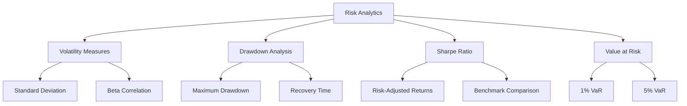
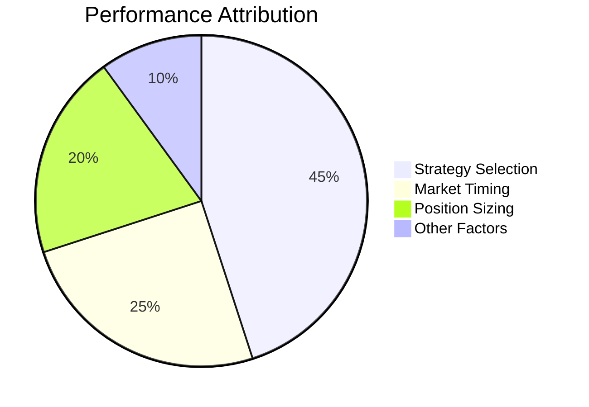

## What is Performance Analytics?

Performance Analytics in Hyperscript provides comprehensive insights into your trading activities, helping you understand profitability, risk metrics, and strategy effectiveness across all your automated trading bots.

<CardGroup cols={2}>
  <Card title="Real-Time Metrics" icon="chart-line">
    Live tracking of PnL, ROI, and performance indicators
  </Card>
  <Card title="Historical Analysis" icon="clock-rotate-left">
    Deep analysis of past performance and trends
  </Card>
  <Card title="Strategy Comparison" icon="scale-balanced">
    Compare performance across different strategies
  </Card>
  <Card title="Risk Assessment" icon="shield-check">
    Evaluate risk-adjusted returns and exposure
  </Card>
</CardGroup>

## Key Performance Metrics

### Profitability Metrics

<AccordionGroup>
  <Accordion title="Realized PnL">
    Total profits and losses from closed positions across all strategies -
    Daily, weekly, monthly breakdowns - Currency-specific PnL tracking - Tax
    reporting ready summaries
</Accordion>

{" "}
<Accordion title="Unrealized PnL">
  Current open position values and potential profits/losses - Mark-to-market
  valuations - Real-time portfolio value updates - Position-level PnL
  attribution
</Accordion>

  <Accordion title="Return on Investment (ROI)">
    Percentage returns calculated on initial capital deployment - Time-weighted
    returns - Money-weighted returns - Annualized performance metrics
</Accordion>
</AccordionGroup>

### Risk Metrics



<AccordionGroup>
  <Accordion title="Maximum Drawdown">
    The largest peak-to-trough decline in portfolio value - Strategy-specific
    drawdown analysis - Recovery time tracking - Drawdown duration metrics
</Accordion>

{" "}
<Accordion title="Volatility Analysis">
  Measure portfolio stability and risk levels - Rolling volatility windows -
  Correlation with market conditions - Strategy volatility comparison
</Accordion>

  <Accordion title="Sharpe Ratio">
    Risk-adjusted return measurement - Strategy-specific Sharpe ratios -
    Benchmark comparisons - Time period analysis
</Accordion>
</AccordionGroup>

## Performance Dashboards

### Overview Dashboard

The main performance overview provides:

<CheckList>
  - [ ] Total portfolio value and daily change - [ ] Top performing strategies
  this week - [ ] Worst performing strategies requiring attention - [ ] Overall
  portfolio allocation breakdown - [ ] Recent significant trades and their
  impact
</CheckList>

### Strategy Performance Comparison

<Info>
  Compare multiple strategies side-by-side to identify the most effective
  approaches for your portfolio.
</Info>

Key comparison metrics include:

- **Total Return**: Absolute and percentage gains
- **Win Rate**: Percentage of profitable trades
- **Average Trade Size**: Position sizing effectiveness
- **Maximum Consecutive Losses**: Risk streak analysis
- **Profit Factor**: Ratio of gross profits to gross losses

### Time-Based Analysis

<AccordionGroup>
  <Accordion title="Intraday Performance">
    - Hourly PnL patterns - Best and worst trading hours - Market session
    performance - Correlation with market volatility
</Accordion>

{" "}
<Accordion title="Weekly Patterns">
  - Day-of-week performance analysis - Weekend position management - Weekly
  strategy rotation effectiveness
</Accordion>

  <Accordion title="Monthly Trends">
    - Seasonal performance patterns - Monthly return distribution -
    Year-over-year comparisons - Market regime analysis
</Accordion>
</AccordionGroup>

## Advanced Analytics Features

### Attribution Analysis

Understanding what drives your performance:



<CardGroup cols={2}>
  <Card title="Strategy Attribution" icon="puzzle-piece">
    Which strategies contribute most to overall returns
  </Card>
  <Card title="Asset Attribution" icon="coins">
    Performance breakdown by individual assets
  </Card>
  <Card title="Time Attribution" icon="calendar">
    When your strategies perform best
  </Card>
  <Card title="Factor Attribution" icon="chart-scatter">
    Market factor exposure analysis
  </Card>
</CardGroup>

### Correlation Analysis

<Warning>
  High correlation between strategies may indicate concentration risk in your
  portfolio.
</Warning>

Monitor correlations between:

- Different strategy performances
- Strategy performance vs market indices
- Cross-asset correlations in your portfolio
- Performance correlation with market volatility

### Performance Benchmarking

<AccordionGroup>
  <Accordion title="Market Benchmarks">
    Compare your performance against: - Crypto market indices (BTC, ETH) -
    Traditional market benchmarks (S&P 500, NASDAQ) - DeFi yield farming returns
    - Custom benchmark portfolios
</Accordion>

  <Accordion title="Peer Comparison">
    Anonymous comparison with other Hyperscript users: - Similar strategy
    performance - Risk-adjusted return rankings - Portfolio size cohort analysis
</Accordion>
</AccordionGroup>

## Performance Optimization Insights

### Automated Recommendations

Hyperscript's AI analyzes your performance data to provide:

<CheckList>
  - [ ] Underperforming strategy identification - [ ] Optimal rebalancing
  suggestions - [ ] Risk concentration alerts - [ ] Market regime change
  notifications - [ ] Strategy parameter optimization recommendations
</CheckList>

### Custom Performance Alerts

Set up notifications for:

<Tip>
  Configure alerts to stay informed without constantly monitoring your
  portfolio.
</Tip>

- Daily loss limits exceeded
- Strategy performance below thresholds
- Unusual correlation changes
- New all-time portfolio highs
- Drawdown recovery milestones

## Reporting and Export

### Automated Reports

<AccordionGroup>
  <Accordion title="Daily Performance Summary">
    - End-of-day portfolio snapshot - Daily PnL breakdown by strategy - Key
    metric changes from previous day - Upcoming strategy actions
</Accordion>

{" "}
<Accordion title="Weekly Performance Review">
  - Comprehensive week-over-week analysis - Strategy performance rankings - Risk
  metric updates - Market correlation analysis
</Accordion>

  <Accordion title="Monthly Deep Dive">
    - Detailed attribution analysis - Benchmark comparison results - Strategy
    optimization recommendations - Performance trend analysis
</Accordion>
</AccordionGroup>

### Export Options

Export your performance data in various formats:

- **CSV**: Raw data for custom analysis
- **PDF**: Professional reports for sharing
- **JSON**: API integration with external tools
- **Excel**: Detailed spreadsheet analysis

<Note>
  All exports maintain data privacy and can be customized to include only
  specific metrics or time periods.
</Note>

## Performance Analytics API

For advanced users, access performance data programmatically:

```json
{
  "endpoint": "/api/v1/performance/analytics",
  "parameters": {
    "start_date": "2024-01-01",
    "end_date": "2024-12-31",
    "strategies": ["dca_btc", "grid_eth"],
    "metrics": ["total_return", "sharpe_ratio", "max_drawdown"]
  }
}
```

## Next Steps

<CardGroup cols={2}>
  <Card
    title="Risk Management Tools"
    href="/portfolio/risk-management-tools"
    icon="shield"
  >
    Learn about portfolio risk management features
  </Card>
  <Card
    title="Strategy Building Guide"
    href="/guides/strategy-building"
    icon="wrench"
  >
    Build custom strategies based on performance insights
  </Card>
  <Card
    title="Backtesting Engine"
    href="/advanced/backtesting-engine"
    icon="clock-rotate-left"
  >
    Test strategy modifications using historical data
  </Card>
  <Card
    title="Portfolio Dashboard"
    href="/portfolio/dashboard"
    icon="chart-mixed"
  >
    Return to the main portfolio overview
  </Card>
</CardGroup>{" "}
