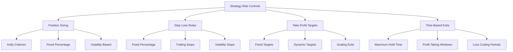
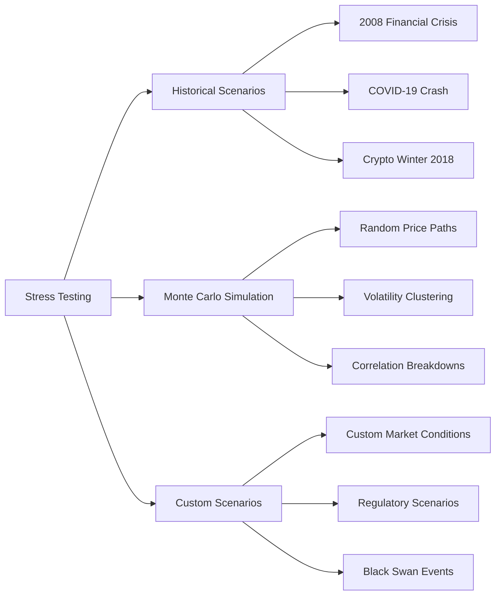

## What are Risk Management Tools?

Hyperscript's Risk Management Tools provide a comprehensive suite of features designed to protect your capital, limit losses, and optimize risk-adjusted returns across all your automated trading strategies.

<CardGroup cols={2}>
  <Card title="Portfolio Protection" icon="shield">
    Safeguard your capital with automated risk controls
  </Card>
  <Card title="Position Sizing" icon="resize">
    Optimal allocation based on risk tolerance
  </Card>
  <Card title="Loss Prevention" icon="triangle-exclamation">
    Stop-loss and take-profit automation
  </Card>
  <Card title="Exposure Monitoring" icon="eye">
    Real-time risk exposure tracking
  </Card>
</CardGroup>

## Core Risk Management Features

### Portfolio-Level Risk Controls

<AccordionGroup>
  <Accordion title="Maximum Drawdown Limits">
    Set portfolio-wide drawdown limits to protect against significant losses -
    Daily maximum loss thresholds - Weekly and monthly drawdown caps - Automatic
    strategy pause when limits are reached - Gradual re-entry protocols after
    recovery
</Accordion>

{" "}
<Accordion title="Portfolio Correlation Management">
  Monitor and limit correlation between strategies - Cross-strategy correlation
  monitoring - Automatic diversification suggestions - Market regime correlation
  analysis - Dynamic correlation-based position sizing
</Accordion>

  <Accordion title="Exposure Limits">
    Control overall market exposure and concentration risk - Maximum portfolio
    allocation per asset - Sector and market cap exposure limits - Geographic
    diversification requirements - Leverage limitation controls
</Accordion>
</AccordionGroup>

### Strategy-Level Risk Controls



<AccordionGroup>
  <Accordion title="Dynamic Position Sizing">
    Intelligent position sizing based on multiple risk factors - **Kelly
    Criterion**: Optimal bet sizing based on edge and odds - **Volatility
    Scaling**: Position size inversely proportional to volatility - **Risk
    Parity**: Equal risk contribution from each position - **Maximum Risk per
    Trade**: Fixed percentage risk limits
</Accordion>

{" "}
<Accordion title="Stop-Loss Mechanisms">
  Multiple stop-loss types for different market conditions - **Fixed Percentage
  Stops**: Simple percentage-based exits - **Trailing Stops**: Dynamic stops
  that follow price movements - **Volatility-Based Stops**: ATR-based stop
  placement - **Time-Based Stops**: Maximum holding period enforcement
</Accordion>

  <Accordion title="Take-Profit Strategies">
    Intelligent profit-taking to lock in gains - **Fixed Target Levels**:
    Predetermined profit targets - **Scaling Exits**: Partial position closures
    at multiple levels - **Dynamic Targets**: Profit targets adjusted based on
    volatility - **Risk-Reward Ratios**: Maintain optimal risk-reward profiles
</Accordion>
</AccordionGroup>

## Advanced Risk Analytics

### Real-Time Risk Monitoring

<Info>
  Monitor your portfolio's risk exposure in real-time with comprehensive risk
  metrics and alerts.
</Info>

Key monitoring features include:

<CheckList>
  - [ ] Value at Risk (VaR) calculations - [ ] Expected Shortfall (Conditional
  VaR) - [ ] Portfolio Beta and correlation tracking - [ ] Concentration risk
  assessment - [ ] Liquidity risk evaluation
</CheckList>

### Risk Metrics Dashboard

<AccordionGroup>
  <Accordion title="Value at Risk (VaR)">
    Statistical measure of potential portfolio losses - 1-day, 1-week, 1-month
    VaR calculations - Parametric and historical simulation methods - Confidence
    levels (95%, 99%, 99.9%) - VaR breakdown by strategy and asset
</Accordion>

{" "}
<Accordion title="Maximum Drawdown Analysis">
  Track and predict potential drawdown scenarios - Historical maximum drawdown
  by period - Monte Carlo drawdown simulations - Recovery time analysis -
  Drawdown correlation with market conditions
</Accordion>

  <Accordion title="Sharpe Ratio Optimization">
    Monitor and optimize risk-adjusted returns - Portfolio-level Sharpe ratio
    tracking - Strategy-specific Sharpe ratios - Rolling Sharpe ratio analysis -
    Benchmark comparison
</Accordion>
</AccordionGroup>

## Risk Scenario Analysis

### Stress Testing

<Warning>
  Regular stress testing helps prepare your portfolio for extreme market
  conditions.
</Warning>

Hyperscript's stress testing features include:



### Scenario Types

<AccordionGroup>
  <Accordion title="Historical Market Events">
    Test portfolio performance against past market crashes - 2008 Financial
    Crisis simulation - COVID-19 market crash (March 2020) - Dot-com bubble
    burst (2000-2002) - Crypto winter scenarios (2018, 2022)
</Accordion>

{" "}
<Accordion title="Monte Carlo Simulations">
  Generate thousands of potential market scenarios - Random walk price
  simulations - Volatility clustering models - Correlation breakdown scenarios -
  Tail risk event simulations
</Accordion>

  <Accordion title="Custom Stress Tests">
    Create tailored scenarios for specific concerns - Regulatory change impacts
    - Exchange downtime scenarios - Liquidity crisis simulations - Black swan
    event modeling
</Accordion>
</AccordionGroup>

## Automated Risk Controls

### Dynamic Risk Adjustment

<Tip>
  Enable automatic risk adjustments to maintain consistent risk levels as market
  conditions change.
</Tip>

Features include:

- **Volatility Regime Detection**: Automatically adjust position sizes based on market volatility
- **Correlation Monitoring**: Reduce allocations when strategies become highly correlated
- **Market Regime Recognition**: Adapt risk parameters for bull/bear/sideways markets
- **Liquidity Adjustment**: Reduce position sizes in illiquid market conditions

### Emergency Protocols

<AccordionGroup>
  <Accordion title="Circuit Breakers">
    Automatic trading halts during extreme market conditions - Portfolio loss
    thresholds (e.g., -5% daily loss) - Individual strategy loss limits - Market
    volatility circuit breakers - Manual emergency stop functionality
</Accordion>

{" "}
<Accordion title="Risk Override System">
  Manual intervention capabilities for extreme situations - Immediate strategy
  shutdown controls - Position liquidation protocols - Risk parameter emergency
  adjustments - Admin notification systems
</Accordion>

  <Accordion title="Recovery Procedures">
    Structured re-entry after risk events - Gradual strategy restart protocols -
    Risk parameter recalibration - Performance validation requirements - Market
    condition assessments
</Accordion>
</AccordionGroup>

## Risk Configuration Options

### Portfolio Risk Settings

Configure your overall portfolio risk parameters:

<CheckList>
  - [ ] Maximum daily portfolio loss percentage - [ ] Maximum individual
  position size - [ ] Correlation limits between strategies - [ ] Overall
  leverage constraints - [ ] Minimum cash reserve requirements
</CheckList>

### Strategy-Specific Risk Controls

<AccordionGroup>
  <Accordion title="DCA Risk Controls">
    - Maximum averaging down levels - Dollar-cost averaging frequency limits -
    Portfolio allocation caps - Market condition overrides
</Accordion>

{" "}
<Accordion title="Grid Trading Risk Controls">
  - Maximum grid levels - Grid spacing limitations - Total grid investment caps
  - Price deviation thresholds
</Accordion>

  <Accordion title="Signal-Based Strategy Controls">
    - Signal confidence thresholds - Maximum trades per signal - Signal
    correlation limits - False signal detection
</Accordion>
</AccordionGroup>

## Risk Reporting and Alerts

### Automated Risk Reports

<AccordionGroup>
  <Accordion title="Daily Risk Summary">
    - Current VaR and exposure levels - Risk limit utilization - Strategy risk
    contributions - Market risk factor exposure
</Accordion>

{" "}
<Accordion title="Weekly Risk Review">
  - Risk-adjusted performance analysis - Correlation matrix updates - Stress
  test results summary - Risk parameter recommendations
</Accordion>

  <Accordion title="Monthly Risk Assessment">
    - Comprehensive risk model validation - Historical accuracy of risk
    predictions - Portfolio risk evolution analysis - Strategic risk management
    recommendations
</Accordion>
</AccordionGroup>

### Real-Time Risk Alerts

Set up instant notifications for:

<Warning>
  Configure risk alerts to receive immediate notification of potential portfolio
  threats.
</Warning>

- VaR threshold breaches
- Correlation spike alerts
- Maximum drawdown warnings
- Position size limit violations
- Market volatility regime changes
- Strategy performance degradation
- Liquidity risk increases

## Risk Management Best Practices

### Position Sizing Guidelines

<Info>
  Follow these position sizing principles to maintain optimal risk levels across
  your portfolio.
</Info>

1. **Never risk more than 1-2% per trade** on individual positions
2. **Limit strategy allocation** to maximum 20-25% of total portfolio
3. **Maintain correlation limits** below 0.7 between strategies
4. **Reserve cash buffers** of at least 10-15% for opportunities
5. **Regular rebalancing** to maintain target allocations

### Risk Monitoring Checklist

<CheckList>
  - [ ] Review daily VaR and portfolio exposure - [ ] Monitor correlation
  changes between strategies - [ ] Check strategy performance against benchmarks
  - [ ] Validate risk model accuracy regularly - [ ] Update risk parameters
  based on market conditions - [ ] Conduct monthly stress testing - [ ] Review
  and adjust stop-loss levels - [ ] Analyze concentration risk by asset/sector
</CheckList>

## Risk Management API

For programmatic risk management:

```json
{
  "endpoint": "/api/v1/risk/portfolio-risk",
  "parameters": {
    "risk_metrics": ["var_95", "max_drawdown", "sharpe_ratio"],
    "time_horizon": "1d",
    "confidence_level": 0.95
  },
  "response": {
    "var_95": -0.0234,
    "max_drawdown": -0.0456,
    "sharpe_ratio": 1.23,
    "risk_alerts": ["correlation_spike"]
  }
}
```

## Next Steps

<CardGroup cols={2}>
  <Card
    title="Performance Analytics"
    href="/portfolio/performance-analytics"
    icon="chart-line"
  >
    Analyze your risk-adjusted performance metrics
  </Card>
  <Card
    title="Risk Management Best Practices"
    href="/guides/risk-management-best-practices"
    icon="graduation-cap"
  >
    Learn advanced risk management strategies
  </Card>
  <Card
    title="Backtesting Engine"
    href="/advanced/backtesting-engine"
    icon="clock-rotate-left"
  >
    Test risk management rules with historical data
  </Card>
  <Card
    title="Portfolio Dashboard"
    href="/portfolio/dashboard"
    icon="chart-mixed"
  >
    Monitor risk in real-time on your dashboard
  </Card>
</CardGroup>{" "}
