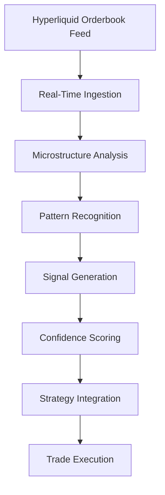

## What is the Orderbook Signal Engine?

Hyperscript's Orderbook Signal Engine is our proprietary system that continuously analyzes the full Hyperliquid orderbook to generate real-time trading signals and market insights. Unlike traditional technical analysis that relies on price and volume data, our engine examines the complete market microstructure to predict price movements before they occur.

## Why Orderbook Analysis Matters

Most trading platforms only show you the tip of the iceberg - completed trades and basic price charts. Our engine sees beneath the surface:

<CardGroup cols={2}>
<Card title="Traditional Analysis" icon="chart-line">
**What everyone else sees:**
- Historical price movements
- Completed trade volumes
- Basic support/resistance levels
- Standard technical indicators

</Card>

<Card title="Hyperscript Advantage" icon="microscope">
**What our engine reveals:**
- Real-time order flow intentions
- Hidden liquidity patterns
- Institutional order behavior
- Price impact predictions before execution

</Card>

</CardGroup>

## Core Signal Categories

### Order Flow Imbalance (OFI) Signals

Our engine tracks the net aggressive buying vs. selling pressure in real-time:

<AccordionGroup>
<Accordion icon="scale-unbalanced" title="Aggressive Flow Detection">
**Measuring immediate market pressure:**
- **Aggressive buyers**: Market orders hitting ask prices
- **Aggressive sellers**: Market orders hitting bid prices
- **Flow ratio**: Real-time buyer/seller aggression balance
- **Institutional patterns**: Large order flow detection

**Signal Interpretation**:

- OFI > +0.7: Strong buying pressure (bullish signal)
- OFI < -0.7: Strong selling pressure (bearish signal)
- OFI near 0: Balanced market (neutral/ranging signal)

</Accordion>

<Accordion icon="eye" title="Hidden Order Detection">
**Revealing concealed trading intentions:**
- **Iceberg orders**: Large orders split into small visible pieces
- **Stealth trading**: Institutional attempts to hide true size
- **Order spoofing**: Fake orders placed to manipulate perception
- **Liquidity mirages**: Orders that disappear when approached

**Trading Applications**:

- Anticipate breakouts when hidden buying builds up
- Avoid false signals from spoofing attempts
- Position size based on true available liquidity

</Accordion>

</AccordionGroup>

### Liquidity Analysis Signals

Understanding where and how much liquidity exists at different price levels:

<CardGroup cols={2}>
<Card title="True Market Depth" icon="layers">
**Beyond visible orderbook:**
- Analysis of order placement patterns
- Estimation of hidden reserve orders
- Liquidity concentration mapping
- Depth quality assessment across price levels

</Card>

<Card title="Liquidity Void Detection" icon="circle-notch">
**Identifying dangerous price gaps:**
- Price levels with minimal support
- Flash crash vulnerability zones
- Breakout acceleration points
- Slippage amplification areas

</Card>

</CardGroup>

### Price Impact Modeling

Predicting how your trades will affect market prices:

<AccordionGroup>
<Accordion icon="target" title="Slippage Prediction Engine">
**Forecast execution costs before trading:**
```javascript
Slippage Prediction Model:
├── Order Size: $10,000 ETH buy
├── Current Spread: 0.05%
├── Predicted Slippage: 0.12%
├── Total Impact: 0.17%
├── Confidence: 87%
└── Recommendation: Split into 3 orders over 15 minutes
```

**Factors Analyzed**:

- Current orderbook depth at each price level
- Recent order flow patterns and market impact history
- Time-of-day liquidity patterns
- Correlation with other asset movements

</Accordion>

<Accordion icon="route" title="Optimal Execution Signals">
**When and how to execute trades:**
- **Best timing windows**: Periods of highest liquidity
- **Order size optimization**: Balance between speed and impact
- **Execution strategy**: Market vs limit order recommendations
- **Multi-venue coordination**: Route across different exchanges when beneficial

</Accordion>

</AccordionGroup>

## Advanced Microstructure Insights

### Market Maker Behavior Analysis

Understanding how professional liquidity providers operate:

<AccordionGroup>
<Accordion icon="robot" title="Market Maker Withdrawal Patterns">
**When professionals step away:**
- **Inventory risk signals**: When MMs reduce exposure
- **Volatility anticipation**: MMs pulling before price moves
- **Information asymmetry**: MMs reacting to privileged information
- **Technical pattern recognition**: MM behavior around key levels

**Trading Implications**:

- Reduced liquidity leads to higher volatility
- MM withdrawal often precedes significant price moves
- Opportunity for contrarian trades when MMs overreact

</Accordion>

<Accordion icon="chart-mixed" title="Spread Dynamics Analysis">
**Bid-ask spread behavior patterns:**
- **Spread widening**: Often precedes volatility increases
- **Spread compression**: Indicates increased competition and liquidity
- **Asymmetric spreads**: Directional bias in market making
- **Time-based patterns**: How spreads change throughout trading day

</Accordion>

</AccordionGroup>

### Volatility Prediction Signals

Forecasting market volatility changes before they happen:

<CardGroup cols={2}>
<Card title="Orderbook-Implied Volatility" icon="wave-square">
**Volatility signals from market structure:**
- Order density distribution analysis
- Bid-ask spread volatility indicators
- Order size variance measurements
- Liquidity fragmentation metrics

</Card>

<Card title="Volatility Regime Detection" icon="thermometer">
**Identifying market state changes:**
- Low volatility → High volatility transitions
- Trending vs ranging market identification
- Volatility clustering pattern recognition
- Mean reversion vs momentum regime shifts

</Card>

</CardGroup>

## Signal Generation Process

### Real-Time Data Processing

Our engine processes orderbook data with microsecond precision:



### Signal Confidence Scoring

Every signal comes with a confidence score based on:

<AccordionGroup>
<Accordion icon="star" title="Signal Reliability Metrics">
**How we score signal quality:**
- **Historical accuracy**: Track record of similar signals
- **Market regime compatibility**: Signal performance in current conditions
- **Data quality**: Completeness and reliability of underlying data
- **Cross-validation**: Confirmation from multiple signal types
- **Uncertainty quantification**: Statistical confidence intervals

**Confidence Scale**:

- 90-100%: Highest confidence, rare but strong signals
- 70-89%: High confidence, suitable for primary strategy decisions
- 50-69%: Medium confidence, useful for confirmation
- 30-49%: Low confidence, filter or secondary signals only
- <30%: Very low confidence, generally ignored

</Accordion>

</AccordionGroup>

## Unique Hyperscript Signals

### Signals Available Only on Hyperscript

These proprietary signals are exclusive to our platform:

<CardGroup cols={2}>
<Card title="Liquidity Migration Tracking" icon="arrows-rotate">
**Following where smart money moves:**
- Tracking institutional order placement patterns
- Identifying accumulation/distribution phases
- Detecting rotation between different assets
- Monitoring cross-asset liquidity flows

</Card>

<Card title="Momentum Ignition Detection" icon="rocket">
  **Catching artificial momentum creation:** - Identifying attempts to trigger
  algorithmic buying - Detecting coordinated order placement - Recognizing
  momentum ignition patterns - Predicting follow-through probability

</Card>

<Card title="Reversion Pressure Gauges" icon="arrows-left-right">
  **Measuring mean reversion forces:** - Quantifying how far price deviates from
  fair value - Calculating reversion probability at each level - Measuring
  elastic vs inelastic price regions - Identifying high-probability reversal
  zones

</Card>

<Card title="Correlation Breakdown Alerts" icon="unlink">
**When normal relationships break:**
- Detecting when ETH/BTC correlation weakens
- Identifying asset-specific news impact
- Recognizing sector rotation opportunities
- Alert for pair trading opportunities

</Card>

</CardGroup>

### Signal Integration Examples

Here's how our signals work together in practice:

<AccordionGroup>
<Accordion icon="example" title="Breakout Confirmation Signal Combo">
**Multiple signals confirming a breakout:**

```javascript
ETH Breakout Analysis at $2,050 resistance:
├── Order Flow Imbalance: +0.82 (Strong buying)
├── Hidden Liquidity: Large buy orders detected above $2,050
├── Market Maker Withdrawal: 60% reduction in sell-side liquidity
├── Momentum Ignition: Coordinated buying pattern detected
├── Volatility Expansion: 40% probability of high volatility
└── Combined Confidence: 91% (Execute breakout strategy)
```

**Strategy Action**: Enter long position with 91% confidence, target $2,120 based on liquidity void analysis.

</Accordion>

<Accordion icon="example" title="Reversal Signal Combination">
**Mean reversion opportunity identification:**

```javascript
ETH Oversold Analysis at $1,920 support:
├── Order Flow Imbalance: -0.75 (Heavy selling exhaustion)
├── Reversion Pressure: +0.88 (Strong mean reversion force)
├── Liquidity Analysis: Massive buy orders building at $1,900-1,920
├── Market Maker Behavior: Increasing bid-side liquidity
├── Volatility Prediction: 70% chance of volatility decrease
└── Combined Confidence: 84% (Execute reversal strategy)
```

**Strategy Action**: Enter long position near $1,920, target $1,980 bounce based on liquidity concentration.

</Accordion>

</AccordionGroup>

## Signal Performance & Validation

### Backtesting & Validation Framework

We continuously validate our signals against historical data:

<CardGroup cols={3}>
<Card title="Historical Accuracy" icon="clock-rotate-left">
90%+ directional accuracy on high-confidence signals over 12-month period

</Card>

<Card title="Real-Time Performance" icon="zap">
  Sub-100ms signal generation from orderbook update to actionable insight

</Card>

<Card title="False Positive Rate" icon="shield-check">
<5% false positive rate on signals with confidence >80%

</Card>

</CardGroup>

### Signal Performance Metrics

Track how our signals perform in your trading:

- **Signal Hit Rate**: Percentage of signals that correctly predict direction
- **Profit Factor**: Total profits divided by total losses from signal trades
- **Average Signal Latency**: Time from signal generation to actionable insight
- **Signal Persistence**: How long signal advantages typically last
- **Risk-Adjusted Returns**: Sharpe ratio of signal-based strategies

## Using Signals in Your Trading

### Signal-Based Strategy Integration

<AccordionGroup>
<Accordion icon="settings" title="Signal Configuration">
**Customize signals for your strategy:**
- **Signal selection**: Choose which signals to include
- **Weight allocation**: How much influence each signal has
- **Confidence thresholds**: Minimum confidence required for action
- **Timeframe settings**: Signal lookback and update frequency
- **Risk integration**: How signals interact with risk management

</Accordion>

<Accordion icon="bell" title="Signal Alerts & Notifications">
**Stay informed of important signals:**
- **High-confidence signals**: Immediate notifications for >85% confidence
- **Portfolio-relevant signals**: Alerts for your active trading pairs
- **Regime change alerts**: When market conditions shift significantly
- **Signal degradation warnings**: When previously reliable signals weaken

</Accordion>

</AccordionGroup>

### Best Practices for Signal Usage

<CheckList>
  - Start with high-confidence signals (>70%) and gradually experiment with
  lower confidence - Combine multiple complementary signals rather than relying
  on single signals - Always validate signals with traditional technical
  analysis - Use position sizing based on signal confidence levels - Monitor
  signal performance and adjust thresholds based on results - Never override
  risk management rules based solely on signal strength

</CheckList>

## Signal Engine Roadmap

### Current Development

We're continuously improving our signal engine:

<CardGroup cols={2}>
<Card title="Machine Learning Enhancement" icon="brain">
**AI-powered signal improvement:**
- Deep learning pattern recognition
- Adaptive signal threshold optimization
- Market regime detection automation
- Personalized signal tuning based on your trading behavior

</Card>

<Card title="Multi-Asset Integration" icon="chart-pie">
  **Cross-asset signal analysis:** - ETH/BTC relative strength signals - DeFi
  sector rotation indicators - Layer-1 vs Layer-2 momentum signals - Stablecoin
  flow analysis for market sentiment

</Card>

<Card title="External Data Integration" icon="globe">
  **Enhanced signal context:** - Macro economic indicator integration - On-chain
  data correlation analysis - Social sentiment signal incorporation - News event
  impact prediction

</Card>

<Card title="Execution Optimization" icon="zap">
**Better trade execution:**
- MEV protection signal integration
- Gas optimization timing signals
- Multi-venue execution coordination
- Slippage minimization algorithms

</Card>

</CardGroup>

## Next Steps

<CardGroup cols={2}>
<Card title="Technical Indicators" icon="chart-mixed" href="/signals/technical-indicators">
  Explore traditional and advanced technical analysis tools.

</Card>

<Card
  title="Signal-Based Trading"
  icon="radar"
  href="/trading-strategies/signal-based-trading"
>
  Learn how to build strategies using our signals.

</Card>

<Card
  title="Trading Wizard"
  icon="magic-wand"
  href="/trading-strategies/trading-wizard"
>
  Get AI-powered recommendations for signal usage.

</Card>

<Card title="Backtesting Engine" icon="clock-rotate-left" href="/advanced/backtesting-engine">
  Test signal strategies against historical data.

</Card>

</CardGroup>

<Note>
  Our Orderbook Signal Engine represents years of research into market
  microstructure and provides institutional-grade insights to retail traders.
  The signals are continuously evolving and improving based on market feedback
  and technological advances.

</Note>{" "}
