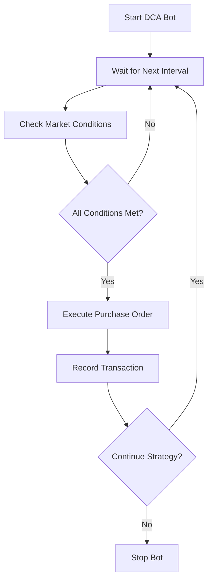

## What is Dollar-Cost Averaging?

Dollar-Cost Averaging (DCA) is an investment strategy where you buy a fixed dollar amount of an asset at regular intervals, regardless of its price. This approach reduces the impact of volatility by spreading purchases over time.

## How DCA Works

Instead of trying to time the market, DCA bots make consistent purchases that naturally buy more shares when prices are low and fewer when prices are high.

<Info>
**Example**: Buying $100 of ETH every week:
- Week 1: ETH at $2,000 → Buy 0.05 ETH
- Week 2: ETH at $1,600 → Buy 0.0625 ETH  
- Week 3: ETH at $2,400 → Buy 0.042 ETH

Average cost: ~$1,950 despite prices ranging from $1,600 to $2,400

</Info>

### DCA Investment Flow



## Benefits of DCA Strategy

<CardGroup cols={2}>
<Card title="Volatility Reduction" icon="chart-mixed">
Smooths out price volatility by averaging purchase prices over time.

</Card>

<Card title="Emotional Discipline" icon="brain">
  Removes fear and greed from investment decisions through systematic execution.

</Card>

<Card title="Lower Average Cost" icon="trending-down">
  Often achieves better average prices than lump-sum investing in volatile
  markets.

</Card>

<Card title="Accessibility" icon="heart">
Allows smaller investors to build positions gradually without large upfront capital.

</Card>

</CardGroup>

## DCA Strategy Types

### Fixed Amount DCA

Purchase the same dollar amount at each interval:

<AccordionGroup>
<Accordion icon="calendar" title="Time-Based DCA">
**Regular intervals based on time:**
- Daily: $10-50 per day for active accumulation
- Weekly: $50-200 per week for balanced approach
- Monthly: $200-1000 per month for larger investors
- Custom: Any interval from 6 hours to 30 days

</Accordion>

<Accordion icon="chart-line" title="Price-Based DCA">
**Purchases triggered by price movements:**
- **Dip buying**: Extra purchases when price drops >5%
- **Averaging down**: Increase purchase amount during downtrends
- **Volatility triggered**: Buy when daily volatility exceeds threshold

</Accordion>

</AccordionGroup>

### Dynamic DCA

Adjust purchase amounts based on market conditions:

<CardGroup cols={2}>
<Card title="Value-Based DCA" icon="calculator">
Increase purchases when assets appear undervalued based on technical indicators.

</Card>

<Card title="Volatility-Adjusted DCA" icon="wave-square">
  Larger purchases during high volatility periods for better average pricing.

</Card>

<Card title="Performance-Based DCA" icon="chart-area">
  Adjust amounts based on recent portfolio performance and available capital.

</Card>

<Card title="Signal-Enhanced DCA" icon="radar">
Incorporate market signals to optimize purchase timing within intervals.

</Card>

</CardGroup>

## Configuration Options

### Basic DCA Setup

<AccordionGroup>
<Accordion icon="dollar-sign" title="Investment Parameters">
**Core DCA settings:**
- **Purchase Amount**: $10-1000+ per transaction
- **Investment Frequency**: 6 hours to 30 days
- **Total Budget**: Maximum total investment (optional)
- **Duration**: Time limit or number of purchases
- **Asset Selection**: Single asset or multiple assets

</Accordion>

<Accordion icon="clock" title="Timing Configuration">
**When and how often to buy:**
- **Start Date**: Immediate or scheduled start
- **Purchase Time**: Specific time of day (e.g., 2 PM UTC)
- **Weekend Trading**: Enable/disable weekend purchases
- **Holiday Schedule**: Pause during market holidays
- **Time Zone**: Local time zone for scheduling

</Accordion>

</AccordionGroup>

### Advanced DCA Features

<AccordionGroup>
<Accordion icon="chart-line-down" title="Conditional Purchasing">
**Smart conditions for purchase execution:**
- **Price deviation limits**: Skip purchase if price moved >X% recently
- **Liquidity checks**: Ensure adequate market depth
- **Volatility filters**: Pause during extreme volatility
- **Market hours**: Restrict to specific trading windows
- **Correlation limits**: Avoid purchases when assets highly correlated

</Accordion>

<Accordion icon="gear" title="Order Execution">
**How purchases are executed:**
- **Order Type**: Market orders (immediate) vs limit orders (better price)
- **Slippage Tolerance**: 0.1-2% maximum acceptable slippage
- **Order Splitting**: Break large orders into smaller chunks
- **Retry Logic**: Reattempt failed orders with adjusted parameters
- **MEV Protection**: Use private mempools to prevent frontrunning

</Accordion>

</AccordionGroup>

## Setting Up Your DCA Bot

### Step 1: Strategy Selection

1. Navigate to **Strategies → DCA Bot**
2. Click **"Create New DCA Bot"**
3. Choose your target asset (ETH, BTC, SOL, etc.)
4. Select DCA type (Fixed Amount, Dynamic, etc.)

### Step 2: Configure Parameters

<AccordionGroup>
<Accordion icon="settings" title="Basic Configuration">
```javascript
DCA Bot Settings:
├── Asset: ETH
├── Purchase Amount: $100
├── Frequency: Every 7 days
├── Purchase Time: 14:00 UTC
├── Total Budget: $5,000 (50 purchases)
└── Duration: 1 year or until budget exhausted
```

</Accordion>

<Accordion icon="shield" title="Risk Management">
  - **Maximum single purchase**: $150 (50% above normal) - **Price deviation
  limit**: 10% (skip if price moved dramatically) - **Slippage tolerance**: 0.5%
  - **Emergency stop**: Pause on 15% daily portfolio loss - **Minimum balance**:
  Maintain $50 buffer in account

</Accordion>

<Accordion icon="bell" title="Notifications">
- **Purchase confirmations**: Email + SMS alerts
- **Failed purchase alerts**: Immediate notification
- **Weekly summaries**: Performance and statistics
- **Budget warnings**: Alert when 90% budget consumed
- **Price alerts**: Notify on significant price movements

</Accordion>

</AccordionGroup>

### Step 3: Backtesting

Test your DCA strategy against historical data:

1. **Select time period**: 6 months to 2 years
2. **Review metrics**: Total return, average cost, max drawdown
3. **Compare strategies**: DCA vs lump-sum vs alternative intervals
4. **Optimize parameters**: Adjust frequency and amounts based on results

<Tip>
  DCA typically outperforms lump-sum investing in volatile markets but may
  underperform in strong bull markets.

</Tip>

## Multi-Asset DCA Strategies

### Portfolio DCA

Apply DCA across multiple assets simultaneously:

<CardGroup cols={2}>
<Card title="Diversified DCA" icon="chart-pie">
**Balanced approach:**
- 40% ETH, 30% BTC, 20% SOL, 10% USDC
- Weekly purchases maintaining allocation ratios
- Automatic rebalancing between DCA purchases

</Card>

<Card title="Rotational DCA" icon="arrows-rotate">
**Alternating focus:**
- Week 1: ETH purchase
- Week 2: BTC purchase  
- Week 3: SOL purchase
- Week 4: Restart cycle

</Card>

</CardGroup>

### Conditional Multi-Asset DCA

Adjust asset allocation based on market conditions:

- **Relative strength**: More DCA into outperforming assets
- **Mean reversion**: Increase DCA into underperforming assets
- **Volatility-based**: Larger allocation to less volatile assets during uncertain times
- **Correlation-aware**: Reduce allocation to highly correlated assets

## Performance Optimization

### Purchase Timing Optimization

<AccordionGroup>
<Accordion icon="chart-bar" title="Intraday Timing">
**Optimize purchase times within the day:**
- **Volatility analysis**: Buy during historically low-volatility hours
- **Liquidity timing**: Purchase when orderbook depth is highest
- **Geographic optimization**: Align with major market opening/closing times
- **Weekend effect**: Take advantage of different weekend pricing patterns

</Accordion>

<Accordion icon="calendar-days" title="Weekly/Monthly Patterns">
**Optimize purchase days:**
- **Day-of-week effects**: Some days historically show better prices
- **Month-end patterns**: Institutional rebalancing can create opportunities
- **Options expiry**: Coordinate with major derivatives expiry dates
- **Seasonal patterns**: Adjust for known seasonal trends (if any)

</Accordion>

</AccordionGroup>

### Cost Minimization

- **Gas optimization**: Time purchases for lower network fees
- **Exchange selection**: Route orders to lowest-fee exchanges
- **Batch processing**: Combine multiple small purchases when beneficial
- **Fee tier management**: Structure purchases to achieve lower fee tiers

## Performance Monitoring

### Key Metrics

<CardGroup cols={3}>
<Card title="Average Cost" icon="calculator">
Your volume-weighted average purchase price vs current market price

</Card>

<Card title="Total Return" icon="chart-line">
  Current portfolio value vs total amount invested

</Card>

<Card title="Purchase Efficiency" icon="target">
  How well your average cost compares to average market price over period

</Card>

<Card title="Volatility Reduction" icon="shield">
  Portfolio volatility vs underlying asset volatility

</Card>

<Card title="Max Drawdown" icon="arrow-down">
  Largest unrealized loss from peak portfolio value

</Card>

<Card title="Sharpe Ratio" icon="star">
Risk-adjusted returns accounting for volatility

</Card>

</CardGroup>

### Performance Dashboard

Track your DCA bot's effectiveness:

- **Purchase history chart**: Visual timeline of all purchases with prices
- **Cost basis tracking**: Running average cost vs current price
- **Comparison analysis**: DCA performance vs lump-sum investment
- **Efficiency metrics**: Purchase timing quality and cost optimization

## Advanced DCA Strategies

### Signal-Enhanced DCA

Combine DCA with market signals for improved timing:

<AccordionGroup>
<Accordion icon="chart-mixed" title="Technical Signal DCA">
**Incorporate technical analysis:**
- **RSI-based**: Increase purchases when RSI indicates oversold conditions
- **Moving average**: Extra purchases when price below moving average
- **Support/resistance**: Time purchases near support levels
- **Bollinger Bands**: Buy more when price touches lower band

</Accordion>

<Accordion icon="newspaper" title="Fundamental Signal DCA">
**Use fundamental and sentiment indicators:**
- **Fear & Greed Index**: Increase during extreme fear periods
- **On-chain metrics**: Adjust based on network activity and holding patterns
- **News sentiment**: Pause during extremely negative news cycles
- **Macro indicators**: Modify based on broader economic conditions

</Accordion>

</AccordionGroup>

### Dynamic DCA Adjustments

Automatically adjust DCA parameters based on performance:

- **Performance feedback**: Increase amounts after successful periods
- **Volatility adjustment**: Modify frequency based on asset volatility
- **Capital allocation**: Redistribute between assets based on relative performance
- **Risk scaling**: Adjust amounts based on overall portfolio risk level

## Common Mistakes & Solutions

<Warning>
**Avoid These DCA Pitfalls:**

- **Stopping during downturns**: DCA works best when continued through volatility
- **Inconsistent execution**: Manual intervention often reduces DCA effectiveness
- **Ignoring fees**: High transaction costs can erode DCA benefits
- **Wrong frequency**: Too frequent DCA may increase costs; too infrequent may miss opportunities

</Warning>

### Troubleshooting

<AccordionGroup>
<Accordion icon="credit-card" title="High Transaction Costs">
**Problem**: Fees consuming significant portion of purchases

**Solutions**:

- Increase purchase amounts to reduce relative fee impact
- Extend intervals between purchases
- Use exchanges with lower fees or fee-free promotions
- Consider layer-2 solutions for lower gas costs

</Accordion>

<Accordion icon="chart-line-down" title="Poor Performance">
**Problem**: DCA underperforming expectations

**Solutions**:

- Review and optimize purchase timing
- Consider dynamic adjustments based on market conditions
- Analyze asset selection and diversification
- Compare to appropriate benchmarks (not just buy-and-hold)

</Accordion>

</AccordionGroup>

## Next Steps

<CardGroup cols={2}>
<Card title="Portfolio Rebalancer" icon="balance-scale" href="/trading-strategies/smart-portfolio-rebalancer">
  Combine DCA with automatic portfolio rebalancing.

</Card>

<Card title="Grid Trading" icon="grid" href="/trading-strategies/grid-trading">
  Explore more active trading strategies for volatile markets.

</Card>

<Card
  title="Trading Wizard"
  icon="magic-wand"
  href="/trading-strategies/trading-wizard"
>
  Get AI recommendations for optimal DCA parameters.

</Card>

<Card title="Performance Analytics" icon="chart-mixed" href="/portfolio/performance-analytics">
  Deep dive into DCA performance analysis and optimization.

</Card>

</CardGroup>
