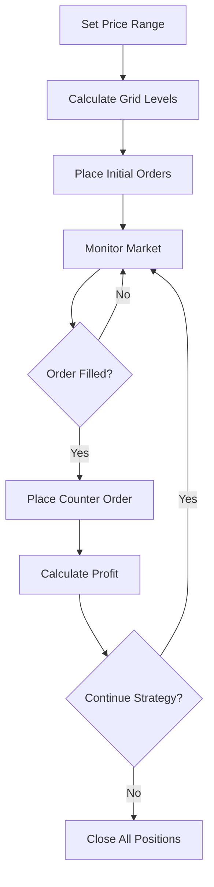

## What is Grid Trading?

Grid Trading is a systematic strategy that places multiple buy and sell orders at predefined price intervals (grids) around the current market price. This approach profits from natural market volatility by automatically buying dips and selling rallies within a trading range.

## How Grid Trading Works

Grid bots create a "grid" of orders above and below the current price, executing trades as the market moves through different price levels.

<Info>
**Example**: ETH trading at $2,000
- **Buy orders**: $1,900, $1,800, $1,700 (below current price)
- **Sell orders**: $2,100, $2,200, $2,300 (above current price)
- **Grid spacing**: $100 between each level

As price moves, the bot automatically buys low and sells high, capturing profits from volatility.

</Info>

### Grid Trading Flow



## Grid Trading Benefits

<CardGroup cols={2}>
<Card title="Volatility Profits" icon="chart-mixed">
Turns market volatility into consistent profits through systematic trading.
</Card>

<Card title="Automated Execution" icon="robot">
  Removes emotion and timing decisions from trading process.
</Card>

<Card title="Range-Bound Markets" icon="arrows-left-right">
  Particularly effective in sideways or ranging markets.
</Card>

<Card title="Consistent Income" icon="coins">
Generates regular trading profits from price oscillations.
</Card>
</CardGroup>

## Grid Strategy Types

### Arithmetic Grid

Orders placed at equal dollar intervals:

<AccordionGroup>
<Accordion icon="calculator" title="Fixed Spacing Grid">
**Equal dollar amounts between levels:**
- Current price: $2,000
- Grid spacing: $50
- Levels: $1,900, $1,950, $2,000, $2,050, $2,100
- **Best for**: Stable, established assets with predictable volatility
</Accordion>

<Accordion icon="chart-line" title="Dynamic Spacing Grid">
**Adjusting spacing based on volatility:**
- **Low volatility**: Tighter grids (smaller spacing)
- **High volatility**: Wider grids (larger spacing)  
- **Trend detection**: Asymmetric grids favoring trend direction
- **Best for**: Adapting to changing market conditions
</Accordion>
</AccordionGroup>

### Geometric Grid

Orders placed at equal percentage intervals:

<CardGroup cols={2}>
<Card title="Percentage-Based Grid" icon="percentage">
**Fixed percentage spacing:**
- ±2% levels: $1,960, $1,980, $2,000, $2,020, $2,040
- ±5% levels: $1,900, $1,950, $2,000, $2,050, $2,100
- **Better for**: High-volatility assets with exponential price movements
</Card>

<Card title="Logarithmic Grid" icon="chart-line-up">
**Spacing increases with distance:**
- Close levels: ±1%
- Distant levels: ±5%, ±10%
- **Best for**: Capturing both small oscillations and large moves
</Card>
</CardGroup>

## Configuration Parameters

### Grid Setup

<AccordionGroup>
<Accordion icon="range" title="Price Range Definition">
**Setting your trading boundaries:**
- **Upper bound**: Maximum price where selling stops
- **Lower bound**: Minimum price where buying stops
- **Current price positioning**: Center, top, or bottom of range
- **Range calculation**: Based on support/resistance, volatility, or manual setting

**Example**: ETH grid from $1,500 to $2,500 with current price at $2,000

</Accordion>

<Accordion icon="grid" title="Grid Density">
  **Number and spacing of orders:** - **Total grid levels**: 10-50 levels (more
  = smaller profits per trade) - **Grid spacing**: $10-200 depending on asset
  and strategy - **Order distribution**: Equal spacing vs concentrated around
  current price - **Asymmetric grids**: More buy orders than sell orders (or
  vice versa)
</Accordion>

<Accordion icon="dollar-sign" title="Position Sizing">
**How much to trade at each level:**
- **Equal amounts**: Same dollar value at each grid level
- **Pyramiding**: Increasing amounts further from current price
- **Martingale**: Doubling amounts at each level (higher risk)
- **Total capital allocation**: Percentage of portfolio for this grid
</Accordion>
</AccordionGroup>

### Risk Management

<AccordionGroup>
<Accordion icon="shield" title="Stop Loss & Take Profit">
**Exit conditions for the entire grid:**
- **Grid stop loss**: Close all positions if price breaks below lower bound
- **Grid take profit**: Close positions and take profits at upper bound
- **Time-based exits**: Close grid after specific duration
- **Drawdown limits**: Stop if unrealized losses exceed threshold
</Accordion>

<Accordion icon="chart-line-down" title="Trend Protection">
**Protecting against strong trends:**
- **Trend detection**: Pause grid during strong directional moves
- **Asymmetric grids**: Favor one direction based on trend analysis
- **Stop trailing**: Adjust grid range as trends develop
- **Momentum filters**: Require low momentum before grid activation
</Accordion>
</AccordionGroup>

## Setting Up Your Grid Bot

### Step 1: Market Analysis

Before creating a grid, analyze your chosen market:

1. **Identify trading range**: Look for clear support and resistance levels
2. **Assess volatility**: Ensure sufficient price movement for profitability
3. **Check liquidity**: Verify adequate orderbook depth at your price levels
4. **Trend analysis**: Confirm market is range-bound rather than trending

<Tip>
  Grid trading works best in sideways markets with regular volatility. Avoid
  during strong trending periods.
</Tip>

### Step 2: Configure Your Grid

<AccordionGroup>
<Accordion icon="settings" title="Basic Grid Settings">
```javascript
Grid Bot Configuration:
├── Asset: ETH/USDC
├── Price Range: $1,800 - $2,200
├── Current Price: $2,000
├── Grid Levels: 20
├── Grid Spacing: $20 ($400 range ÷ 20 levels)
├── Investment per Level: $100
└── Total Investment: $2,000 (20 levels × $100)
```
</Accordion>

<Accordion icon="gear-complex" title="Advanced Settings">
- **Order type**: Limit orders for better execution
- **Slippage tolerance**: 0.3% maximum
- **Rebalancing frequency**: Check every 30 seconds
- **MEV protection**: Use private mempool
- **Gas optimization**: Batch order updates when possible
</Accordion>
</AccordionGroup>

### Step 3: Risk Configuration

Set comprehensive risk controls:

<CheckList>
  - Grid stop loss at 10% below lower bound - Maximum 15% of portfolio
  allocation - Daily loss limit of 5% - Trend detection enabled (pause on 15%
  single-direction move) - Minimum liquidity requirement: $10k orderbook depth
</CheckList>

## Grid Performance Optimization

### Optimal Grid Spacing

Balance between trade frequency and profit per trade:

<CardGroup cols={2}>
<Card title="Tight Grids" icon="compress">
**Smaller spacing (higher frequency):**
- More trades, smaller profits each
- Better for stable, low-volatility assets
- Higher transaction costs relative to profits
- Requires more active monitoring
</Card>

<Card title="Wide Grids" icon="expand">
**Larger spacing (lower frequency):**
- Fewer trades, larger profits each
- Better for volatile assets
- Lower relative transaction costs
- More passive approach
</Card>
</CardGroup>

### Dynamic Grid Adjustments

Automatically optimize grid parameters:

<AccordionGroup>
<Accordion icon="chart-mixed" title="Volatility-Based Adjustments">
**Adapt to changing volatility:**
- Increase spacing during high volatility periods
- Tighten spacing during low volatility periods
- Adjust position sizes based on recent volatility
- Modify stop loss levels based on asset volatility
</Accordion>

<Accordion icon="trending-up" title="Trend-Aware Grids">
**Respond to market trends:**
- Shift grid range upward during uptrends
- Add more buy orders during downtrends
- Reduce grid density during strong trends
- Implement trailing stops for trend protection
</Accordion>
</AccordionGroup>

## Advanced Grid Strategies

### Multi-Timeframe Grids

Layer multiple grids with different characteristics:

<CardGroup cols={2}>
<Card title="Scalping Grid" icon="zap">
**Short-term, tight spacing:**
- 5-10 minute timeframe
- Small spacing ($5-15)
- Quick profit taking
- High frequency trading
</Card>

<Card title="Swing Grid" icon="wave-square">
**Medium-term, wider spacing:**
- 1-4 hour timeframe
- Moderate spacing ($25-100)
- Larger position sizes
- Trend-following elements
</Card>
</CardGroup>

### Hybrid Grid Strategies

Combine grid trading with other approaches:

<AccordionGroup>
<Accordion icon="chart-line" title="DCA-Enhanced Grid">
**Add dollar-cost averaging to grids:**
- Base DCA purchases at regular intervals
- Grid trading for additional volatility capture
- Separate capital allocation for each strategy
- Coordinated entry and exit points
</Accordion>

<Accordion icon="balance-scale" title="Rebalancing Grid">
**Integrate with portfolio rebalancing:**
- Grid trading within asset allocation targets
- Automatic rebalancing when grids reach extremes
- Multi-asset grid coordination
- Portfolio-level risk management
</Accordion>
</AccordionGroup>

## Performance Monitoring

### Key Grid Metrics

<CardGroup cols={3}>
<Card title="Grid Efficiency" icon="chart-pie">
Percentage of grid levels that have generated profits
</Card>

<Card title="Profit per Trade" icon="dollar-sign">
  Average profit captured per executed trade pair
</Card>

<Card title="Order Fill Rate" icon="percentage">
  How often your limit orders get filled vs rejected
</Card>

<Card title="Range Utilization" icon="arrows-left-right">
  How much of your price range the market has used
</Card>

<Card title="Risk-Adjusted Return" icon="shield-check">
  Returns relative to maximum potential loss
</Card>

<Card title="Market Capture" icon="target">
Percentage of available volatility converted to profit
</Card>
</CardGroup>

### Real-Time Dashboard

Monitor your grid bot performance:

- **Grid visualization**: Live view of all order levels and current price
- **P&L tracking**: Real-time profits from completed trade pairs
- **Order status**: Active, filled, and pending orders at each level
- **Range efficiency**: How well your range captures market movement

## Common Grid Trading Mistakes

<Warning>
**Avoid These Grid Trading Pitfalls:**

- **Wrong market conditions**: Running grids during strong trends
- **Over-leveraging**: Using too much capital in a single grid
- **Ignoring fees**: Not accounting for transaction costs in spacing calculations
- **Static ranges**: Not adjusting ranges as market structure changes
- **No trend protection**: Allowing grids to run against persistent trends
  </Warning>

### Troubleshooting Grid Issues

<AccordionGroup>
<Accordion icon="trending-up" title="Strong Trend Against Grid">
**Problem**: Market breaks out of range, causing large losses

**Solutions**:

- Implement trend detection and grid pausing
- Use asymmetric grids favoring trend direction
- Set stop losses at reasonable levels below/above range
- Consider trend-following strategies instead during strong trends
  </Accordion>

<Accordion icon="credit-card" title="High Transaction Costs">
**Problem**: Fees eating into grid profits

**Solutions**:

- Widen grid spacing to increase profit per trade
- Choose assets and exchanges with lower fees
- Optimize for fewer, larger trades rather than many small ones
- Consider layer-2 solutions for lower gas costs
  </Accordion>

<Accordion icon="ban" title="Poor Order Fills">
**Problem**: Orders not getting filled at desired prices

**Solutions**:

- Check market liquidity at your price levels
- Adjust slippage tolerance if necessary
- Use post-only orders to ensure maker fees
- Monitor for competition from other bots at similar levels
  </Accordion>
</AccordionGroup>

## Next Steps

<CardGroup cols={2}>
<Card title="Martingale Strategies" icon="chart-line-down" href="/trading-strategies/martingale-strategies">
  Explore recovery-focused trading strategies.
</Card>

<Card
  title="Signal-Based Trading"
  icon="radar"
  href="/trading-strategies/signal-based-trading"
>
  Combine grids with market signals for better timing.
</Card>

<Card
  title="Backtesting Engine"
  icon="clock-rotate-left"
  href="/advanced/backtesting-engine"
>
  Test your grid strategies against historical data.
</Card>

<Card title="Portfolio Dashboard" icon="chart-mixed" href="/portfolio/dashboard">
  Monitor multiple grid strategies and overall performance.
</Card>
</CardGroup>
