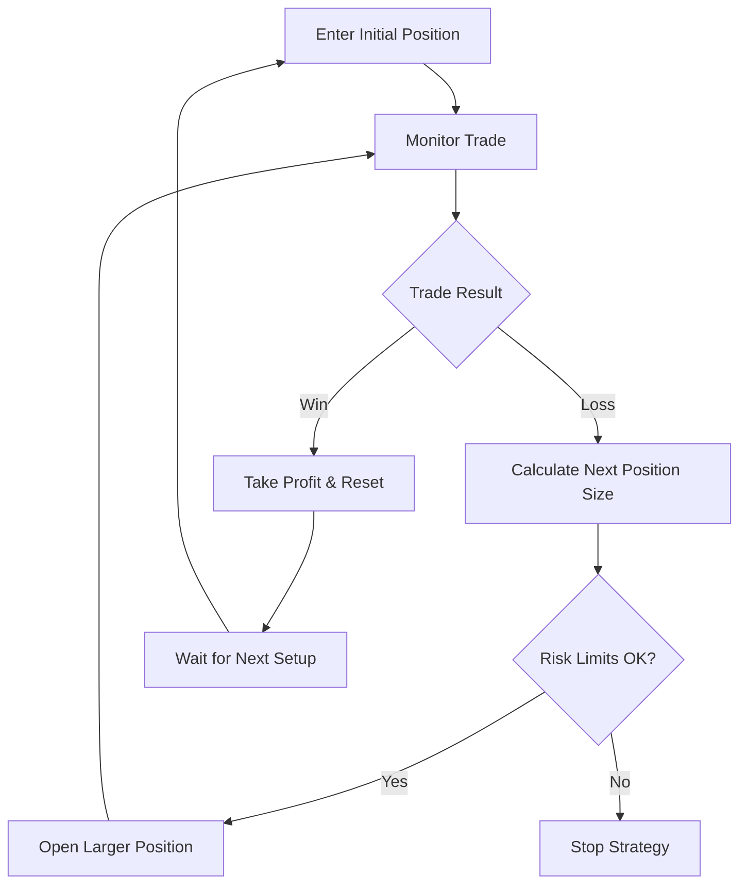

## What is Martingale Trading?

Martingale is a recovery-based trading strategy that increases position sizes after losses with the goal of recovering all previous losses plus a profit when a winning trade occurs. This strategy is based on the principle that markets will eventually reverse direction.

<Warning>
  **High Risk Strategy**: Martingale strategies can lead to significant losses
  during extended trending periods. Only use with strict risk controls and
  position limits.

</Warning>

## How Martingale Works

The strategy doubles (or increases by a multiplier) the position size after each losing trade, so that a single winning trade recovers all previous losses.

<Info>
**Example**: Starting with $100 position
- Trade 1: Lose $100 → Next position $200
- Trade 2: Lose $200 → Next position $400  
- Trade 3: Win $400 → Total recovery: $400 - $300 (losses) = $100 profit

**Total invested**: $700, **Total recovered**: $800, **Net profit**: $100

</Info>

### Martingale Trading Flow



## Martingale Strategy Types

### Classic Martingale

Traditional doubling strategy with fixed multipliers:

<AccordionGroup>
<Accordion icon="calculator" title="Fixed Multiplier Martingale">
**Standard doubling approach:**
- **Multiplier**: 2x after each loss (100 → 200 → 400 → 800)
- **Reset condition**: Any profitable trade resets to base size
- **Best for**: Assets with frequent mean reversion
- **Risk level**: Very high during extended trends

</Accordion>

<Accordion icon="chart-line" title="Conservative Multiplier">
**Slower growth to manage risk:**
- **Multiplier**: 1.5x or 1.3x after each loss
- **Gradual increase**: 100 → 150 → 225 → 337
- **Best for**: Risk-averse traders who want recovery potential
- **Risk level**: High but more manageable

</Accordion>

</AccordionGroup>

### Adaptive Martingale

Dynamic strategies that adjust based on market conditions:

<CardGroup cols={2}>
<Card title="Volatility-Adjusted Martingale" icon="chart-mixed">
**Adapts to market volatility:**
- Higher multipliers during low volatility
- Lower multipliers during high volatility
- Position sizing based on recent price swings

</Card>

<Card title="Trend-Aware Martingale" icon="trending-up">
  **Considers market direction:** - Reduced multipliers against strong trends -
  Increased multipliers in ranging markets - Automatic pause during momentum
  extremes

</Card>

<Card title="Time-Decay Martingale" icon="clock">
  **Reduces risk over time:** - Multipliers decrease with each iteration -
  Maximum recovery attempts limited - Automatic reset after time periods

</Card>

<Card title="Correlation-Based Martingale" icon="link">
**Multi-asset awareness:**
- Adjusts based on asset correlations
- Reduces size when assets move together
- Diversifies across uncorrelated markets

</Card>

</CardGroup>

## Configuration Parameters

### Position Sizing Rules

<AccordionGroup>
<Accordion icon="dollar-sign" title="Base Position & Multipliers">
**Core sizing parameters:**
- **Initial position size**: $50-500 (start conservative)
- **Loss multiplier**: 1.3x to 2.0x (2.0x = classic doubling)
- **Maximum position size**: $5,000 absolute limit
- **Maximum iterations**: 5-7 consecutive losses maximum
- **Reset conditions**: Profit threshold to restart sequence

</Accordion>

<Accordion icon="shield" title="Risk Management">
**Essential safety controls:**
- **Maximum drawdown**: 20% of total capital maximum
- **Daily loss limit**: Stop after losing X% in one day
- **Sequence stop loss**: Exit if losses exceed predetermined amount
- **Cool-down period**: Wait time before restarting after max sequence

</Accordion>

</AccordionGroup>

### Entry & Exit Conditions

<AccordionGroup>
<Accordion icon="chart-line" title="Entry Signals">
**When to start a Martingale sequence:**
- **Mean reversion signals**: RSI oversold/overbought conditions
- **Support/resistance bounces**: Entry near key levels
- **Volatility expansion**: After periods of low volatility
- **Pattern completion**: Technical pattern breakdowns or breakouts

</Accordion>

<Accordion icon="target" title="Exit Strategies">
**How to close positions profitably:**
- **Profit targets**: 1-5% profit to close entire sequence
- **Partial exits**: Take profits on portions of large positions
- **Time-based exits**: Close after predetermined time periods
- **Risk-based exits**: Exit if next position would exceed limits

</Accordion>

</AccordionGroup>

## Setting Up Martingale Strategy

### Step 1: Risk Assessment

Before deploying Martingale, calculate your maximum possible loss:

```javascript
Max Loss Calculation:
Base Position: $100
Multiplier: 2.0x
Max Iterations: 5

Sequence: $100 + $200 + $400 + $800 + $1,600 = $3,100 total risk
Account needed: $15,500 (20% max risk rule)
```

<Warning>
  **Critical**: Ensure you can afford the maximum sequence loss multiple times.
  Martingale can consume capital quickly during adverse conditions.

</Warning>

### Step 2: Strategy Configuration

<AccordionGroup>
<Accordion icon="settings" title="Basic Martingale Setup">
```javascript
Martingale Bot Configuration:
├── Asset: ETH/USDC
├── Base Position: $200
├── Multiplier: 1.5x (conservative)
├── Maximum Iterations: 4
├── Maximum Position: $1,215 (200×1.5³)
├── Total Risk: $1,687 (sequence sum)
├── Account Requirement: $8,435 (20% risk)
└── Profit Target: 2% to reset sequence
```

</Accordion>

<Accordion icon="gear" title="Advanced Settings">
- **Entry conditions**: RSI < 30 (oversold) for long positions
- **Market filters**: Only trade during normal volatility periods
- **Time restrictions**: Avoid major news events and low liquidity hours
- **Correlation checks**: Pause if correlated assets trending strongly

</Accordion>

</AccordionGroup>

### Step 3: Backtesting & Validation

Test your Martingale strategy extensively:

<CheckList>
  - Backtest during various market conditions (trending, ranging, volatile) -
  Analyze maximum drawdown periods and recovery times - Test different
  multipliers and iteration limits - Verify profit consistency vs risk taken -
  Ensure strategy survives worst-case scenarios in historical data

</CheckList>

## Enhanced Martingale Strategies

### Anti-Martingale (Reverse Martingale)

Increase position size after wins instead of losses:

<CardGroup cols={2}>
<Card title="Momentum Martingale" icon="trending-up">
**Ride winning streaks:**
- Increase size after profitable trades
- Reduce to base size after losses
- Better for trending markets
- Lower risk of catastrophic loss

</Card>

<Card title="Hybrid Approach" icon="balance-scale">
**Combine both strategies:**
- Anti-Martingale during trends
- Classic Martingale during ranges
- Dynamic switching based on market regime
- Balanced risk-reward profile

</Card>

</CardGroup>

### Grid Martingale

Combine grid trading with Martingale recovery:

<AccordionGroup>
<Accordion icon="grid" title="Grid-Enhanced Recovery">
**Multiple levels with increasing sizes:**
- Place grid orders at support/resistance levels
- Increase order sizes using Martingale progression
- Profit from multiple small reversions within trend
- More opportunities for recovery than single-position Martingale

</Accordion>

<Accordion icon="arrows-rotate" title="Rolling Martingale Grid">
**Dynamic grid adjustment:**
- Shift grid range as market moves
- Maintain Martingale sizing at each level
- Continuous adaptation to market direction
- Reduced risk of being trapped in single direction

</Accordion>

</AccordionGroup>

## Performance Optimization

### Improving Win Rates

<AccordionGroup>
<Accordion icon="chart-mixed" title="Better Entry Timing">
**Increase probability of reversal:**
- Wait for multiple oversold indicators to align
- Enter near strong support/resistance levels
- Avoid entries during strong momentum periods
- Use shorter timeframes for entry refinement

</Accordion>

<Accordion icon="brain" title="Market Regime Detection">
**Adapt strategy to market conditions:**
- **Ranging markets**: Standard Martingale works well
- **Trending markets**: Use anti-Martingale or avoid entirely
- **High volatility**: Reduce multipliers and position sizes
- **Low volatility**: Can use higher multipliers safely

</Accordion>

</AccordionGroup>

### Risk Reduction Techniques

- **Portfolio diversification**: Run Martingale on multiple uncorrelated assets
- **Time diversification**: Stagger strategy start times to avoid simultaneous losses
- **Capital allocation**: Never risk more than 10% of total portfolio
- **Dynamic position sizing**: Reduce sizes based on recent performance

## Performance Monitoring

### Key Martingale Metrics

<CardGroup cols={3}>
<Card title="Recovery Rate" icon="chart-line-up">
Percentage of sequences that recover to profitability

</Card>

<Card title="Average Sequence Length" icon="list">
  How many trades typically needed for recovery

</Card>

<Card title="Maximum Sequence Cost" icon="exclamation-triangle">
  Highest total loss during any single sequence

</Card>

<Card title="Profit Factor" icon="calculator">
  Total profits divided by total losses

</Card>

<Card title="Risk-Adjusted Return" icon="shield-check">
  Returns relative to maximum risk taken

</Card>

<Card title="Recovery Time" icon="stopwatch">
Average time from loss to full recovery

</Card>

</CardGroup>

### Dashboard Monitoring

Track your Martingale strategy performance:

- **Current sequence status**: Position in current recovery sequence
- **Cumulative P&L**: Total profits/losses across all sequences
- **Risk utilization**: Percentage of maximum risk currently deployed
- **Success rate**: Historical percentage of successful recoveries

## Risk Management & Safety

### Essential Safety Measures

<Warning>
**Mandatory Risk Controls:**

- **Hard stop loss**: Never exceed predetermined maximum loss
- **Position limits**: Cap individual positions regardless of sequence
- **Daily limits**: Stop trading after reaching daily loss threshold
- **Correlation monitoring**: Avoid multiple Martingale strategies on correlated assets
- **Market condition filters**: Pause during extreme volatility or major events

</Warning>

### Emergency Procedures

<AccordionGroup>
<Accordion icon="pause" title="Circuit Breakers">
**Automatic strategy pausing:**
- Portfolio-level losses exceed 15%
- Individual sequence reaches maximum iterations
- Market volatility exceeds 3x normal levels
- Correlation between assets exceeds 0.9

</Accordion>

<Accordion icon="exclamation-triangle" title="Manual Override">
**When to manually stop:**
- Extended trending period against your positions
- Major market structure changes or news events
- Technical issues affecting order execution
- Personal risk tolerance exceeded

</Accordion>

</AccordionGroup>

## Common Martingale Mistakes

<Warning>
**Avoid These Critical Errors:**

- **Under-capitalization**: Not having enough funds for full sequences
- **Ignoring trends**: Running Martingale against persistent trends
- **No exit plan**: Lacking clear rules for stopping losing sequences
- **Correlation ignorance**: Multiple Martingale bots on correlated assets
- **Emotional override**: Manually interfering with systematic execution

</Warning>

### Troubleshooting Issues

<AccordionGroup>
<Accordion icon="trending-down" title="Extended Losing Sequences">
**Problem**: Multiple consecutive losses exceeding expectations

**Solutions**:

- Review entry conditions for better timing
- Reduce multipliers to extend sequence length
- Add market regime filters to avoid unfavorable conditions
- Consider switching to anti-Martingale during trends

</Accordion>

<Accordion icon="credit-card" title="High Transaction Costs">
**Problem**: Fees reducing profits from recovery

**Solutions**:

- Increase profit targets to compensate for fees
- Use exchanges with lower trading fees
- Consider longer-term positions to reduce trade frequency
- Optimize order timing for better fee structures

</Accordion>

</AccordionGroup>

## Next Steps

<CardGroup cols={2}>
<Card title="Signal-Based Trading" icon="radar" href="/trading-strategies/signal-based-trading">
  Combine Martingale with market signals for better entry timing.

</Card>

<Card title="Grid Trading" icon="grid" href="/trading-strategies/grid-trading">
  Explore grid strategies that can complement Martingale approaches.

</Card>

<Card
  title="Risk Management Tools"
  icon="shield-check"
  href="/portfolio/risk-management-tools"
>
  Set up comprehensive risk controls for Martingale strategies.

</Card>

<Card title="Backtesting Engine" icon="clock-rotate-left" href="/advanced/backtesting-engine">
  Thoroughly test Martingale strategies before live deployment.

</Card>

</CardGroup>

<Note>
  **Important Reminder**: Martingale strategies require careful risk management
  and are not suitable for all traders. Always test thoroughly and never risk
  more than you can afford to lose.

</Note>{" "}
