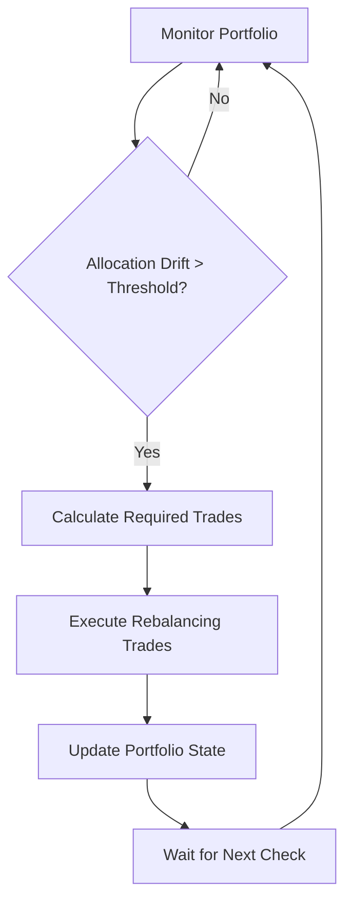

## What is Portfolio Rebalancing?

A Smart Portfolio Rebalancer automatically maintains your desired asset allocation by buying assets that have fallen below their target percentage and selling assets that have risen above it. This strategy captures profits from volatility while maintaining your risk profile.

## How It Works

The rebalancer monitors your portfolio continuously and triggers trades when allocations drift beyond your set thresholds.

<Info>
  **Example**: You want 60% ETH, 40% USDC. ETH pumps and your portfolio becomes
  70% ETH, 30% USDC. The bot sells ETH and buys USDC to restore the 60/40
  balance.

</Info>

### Rebalancing Logic



## Key Benefits

<CardGroup cols={2}>
<Card title="Risk Management" icon="shield-check">
Maintains consistent exposure across asset classes, reducing concentration risk.

</Card>

<Card title="Profit Taking" icon="chart-line-up">
  Automatically sells high-performing assets and buys dips, locking in gains.

</Card>

<Card title="Discipline" icon="robot">
  Removes emotion from rebalancing decisions, ensuring consistent execution.

</Card>

<Card title="Simplicity" icon="circle-check">
Set-and-forget approach perfect for long-term investors.

</Card>

</CardGroup>

## Configuration Options

### Asset Allocation

Define your target portfolio composition:

<AccordionGroup>
<Accordion icon="chart-pie" title="Conservative Portfolios">
**Low-risk, stable allocations:**

- **60% ETH, 30% BTC, 10% USDC**: Balanced crypto exposure with stablecoin buffer
- **40% ETH, 40% BTC, 20% USDC**: Equal major crypto weights with larger stable allocation
- **50% ETH, 25% BTC, 25% SOL**: Diversified across top layer-1 platforms

</Accordion>

<Accordion icon="zap" title="Aggressive Portfolios">
**Higher-risk, growth-focused allocations:**

- **50% ETH, 30% SOL, 20% ARB**: Focus on layer-1 and layer-2 growth
- **40% ETH, 30% BTC, 30% Altcoins**: Broader crypto diversification
- **60% DeFi Tokens, 40% ETH**: Concentrated DeFi exposure

</Accordion>

<Accordion icon="balance-scale" title="Custom Allocations">
**Create your own portfolio:**

Set any combination of supported assets with allocations totaling 100%. Minimum allocation per asset: 5%.

Supported assets: ETH, BTC, SOL, ARB, MATIC, AVAX, USDC, USDT, and more.

</Accordion>

</AccordionGroup>

### Rebalancing Parameters

<AccordionGroup>
<Accordion icon="percent" title="Drift Thresholds">
Control when rebalancing occurs:

- **Conservative**: 2-3% drift (more frequent rebalancing)
- **Moderate**: 5-7% drift (balanced approach)
- **Aggressive**: 10-15% drift (less frequent, larger rebalances)

**Example**: 5% threshold with 60% ETH target triggers rebalancing when ETH allocation reaches 55% or 65%.

</Accordion>

<Accordion icon="clock" title="Time Constraints">
Manage rebalancing frequency:

- **Minimum interval**: 1-24 hours between rebalances
- **Maximum interval**: Force rebalancing after X days regardless of drift
- **Trading hours**: Restrict trading to specific time windows
- **Blackout periods**: Pause during major events or low liquidity

</Accordion>

<Accordion icon="dollar-sign" title="Trade Sizing">
Control individual trade parameters:

- **Minimum trade size**: $10-100 minimum per rebalancing trade
- **Maximum trade size**: Cap individual trades for large portfolios
- **Slippage tolerance**: 0.1-2% maximum acceptable slippage
- **Fee optimization**: Minimize transaction costs through smart routing

</Accordion>

</AccordionGroup>

## Advanced Features

### Dynamic Rebalancing

Adapt rebalancing behavior based on market conditions:

<CardGroup cols={2}>
<Card title="Volatility-Based" icon="chart-mixed">
Increase thresholds during high volatility to reduce trading frequency.

</Card>

<Card title="Momentum-Based" icon="trending-up">
  Delay rebalancing during strong trends to capture additional gains.

</Card>

<Card title="Correlation-Aware" icon="link">
  Consider asset correlations when determining rebalancing urgency.

</Card>

<Card title="Tax-Optimized" icon="receipt">
Prioritize long-term vs short-term gains for tax efficiency.

</Card>

</CardGroup>

### Risk Management Integration

Enhance your rebalancer with comprehensive risk controls:

- **Portfolio heat map**: Visual representation of allocation drift
- **Maximum drawdown limits**: Pause rebalancing during severe losses
- **Correlation monitoring**: Alert when assets become highly correlated
- **Liquidity checks**: Ensure sufficient market depth before trading

## Setting Up Your Rebalancer

### Step 1: Define Your Portfolio

1. Navigate to **Strategies → Portfolio Rebalancer**
2. Click **"Create New Rebalancer"**
3. Select your desired assets from supported list
4. Set target allocations (must total 100%)

```javascript
Example Configuration:
├── ETH: 50%
├── BTC: 30%
├── SOL: 15%
└── USDC: 5%
```

### Step 2: Configure Parameters

<AccordionGroup>
<Accordion icon="settings" title="Basic Settings">
- **Portfolio Name**: "Conservative Crypto Portfolio"
- **Total Portfolio Value**: $10,000
- **Drift Threshold**: 5%
- **Minimum Trade Size**: $25

</Accordion>

<Accordion icon="clock" title="Timing Settings">
  - **Check Frequency**: Every 4 hours - **Minimum Rebalancing Interval**: 12
  hours - **Trading Hours**: 24/7 (or set specific hours) - **Weekend Trading**:
  Enabled

</Accordion>

<Accordion icon="shield" title="Risk Controls">
- **Maximum Daily Trades**: 10
- **Slippage Tolerance**: 0.5%
- **Emergency Stop**: 10% daily loss
- **Position Size Limits**: $2,000 maximum per asset

</Accordion>

</AccordionGroup>

### Step 3: Backtesting & Validation

Before deploying, backtest your strategy:

1. **Select backtest period**: 3-12 months of historical data
2. **Review performance metrics**: Returns, Sharpe ratio, max drawdown
3. **Analyze trade frequency**: Ensure reasonable transaction costs
4. **Compare to buy-and-hold**: Validate rebalancing adds value

<Tip>
  A good rebalancing strategy should outperform buy-and-hold on a risk-adjusted
  basis while reducing volatility.

</Tip>

## Performance Monitoring

### Key Metrics to Track

<CardGroup cols={3}>
<Card title="Total Return" icon="chart-line">
Absolute performance vs initial investment

</Card>

<Card title="Sharpe Ratio" icon="calculator">
  Risk-adjusted returns accounting for volatility

</Card>

<Card title="Max Drawdown" icon="arrow-down">
  Largest peak-to-trough loss during operation

</Card>

<Card title="Rebalancing Alpha" icon="star">
  Excess return vs buy-and-hold strategy

</Card>

<Card title="Transaction Costs" icon="credit-card">
  Total fees as percentage of portfolio value

</Card>

<Card title="Drift Statistics" icon="chart-bar">
Average time to threshold and drift magnitude

</Card>

</CardGroup>

### Real-Time Dashboard

Monitor your rebalancer's status:

- **Current Allocations**: Live portfolio composition with drift indicators
- **Next Rebalancing**: Estimated time until next rebalancing trigger
- **Recent Trades**: History of rebalancing transactions
- **Performance Chart**: Portfolio value over time vs benchmarks

## Optimization Strategies

### Reducing Transaction Costs

<AccordionGroup>
<Accordion icon="route" title="Smart Order Routing">
- Use the most liquid trading pairs for each asset
- Split large rebalancing trades across multiple exchanges
- Time trades during high liquidity periods
- Employ limit orders when market conditions allow

</Accordion>

<Accordion icon="layers" title="Threshold Optimization">
- **Wider thresholds**: Reduce trading frequency but allow more drift
- **Asset-specific thresholds**: Different drift limits for different assets
- **Dynamic thresholds**: Adjust based on volatility and correlation
- **Cost-benefit analysis**: Ensure rebalancing benefits exceed costs

</Accordion>

</AccordionGroup>

### Performance Enhancement

- **Regular review**: Monthly analysis of allocation targets and performance
- **Seasonal adjustments**: Modify allocations based on market cycles
- **Correlation monitoring**: Add uncorrelated assets to improve diversification
- **Strategy combination**: Layer with DCA or momentum strategies

## Common Pitfalls & Solutions

<Warning>
**Avoid These Mistakes:**

- **Over-rebalancing**: Too frequent trades can erode returns through fees
- **Market timing**: Don't manually override during market events
- **Ignoring correlations**: Highly correlated assets don't provide true diversification
- **Static allocations**: Consider periodic review and adjustment of targets

</Warning>

### Troubleshooting Issues

<AccordionGroup>
<Accordion icon="exclamation-triangle" title="Excessive Trading">
**Symptoms**: Very frequent rebalancing, high transaction costs

**Solutions**:

- Increase drift thresholds
- Extend minimum rebalancing intervals
- Review asset volatility and consider more stable alternatives

</Accordion>

<Accordion icon="chart-line-down" title="Underperformance">
**Symptoms**: Returns below buy-and-hold benchmark

**Solutions**:

- Analyze transaction costs vs rebalancing alpha
- Consider wider thresholds or different allocation targets
- Review asset selection and correlation patterns

</Accordion>

</AccordionGroup>

## Next Steps

<CardGroup cols={2}>
<Card title="DCA Strategy" icon="chart-line-up" href="/trading-strategies/dca-bots">
  Combine rebalancing with dollar-cost averaging for enhanced accumulation.

</Card>

<Card title="Grid Trading" icon="grid" href="/trading-strategies/grid-trading">
  Explore grid strategies for more active trading approaches.

</Card>

<Card
  title="Trading Wizard"
  icon="magic-wand"
  href="/trading-strategies/trading-wizard"
>
  Get AI-powered recommendations for optimal portfolio allocations.

</Card>

<Card title="Backtesting" icon="clock-rotate-left" href="/advanced/backtesting-engine">
  Test your rebalancing strategy against historical data.

</Card>

</CardGroup>
