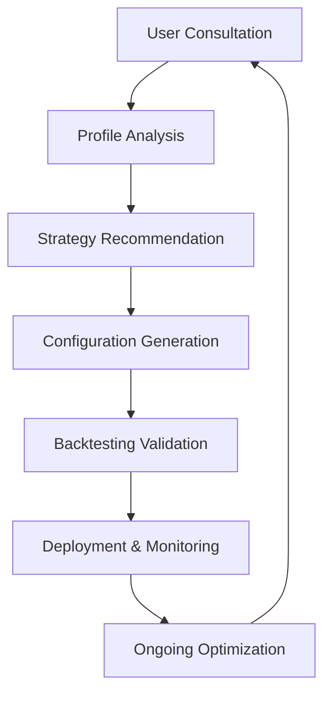

## What is the Trading Wizard?

The Trading Wizard is Nimbus's AI-powered assistant that analyzes your trading goals, risk tolerance, market outlook, and capital to recommend optimal trading strategies. It provides personalized bot configurations, risk management settings, and ongoing strategy optimization.

## How the Trading Wizard Works

Our LLM-powered system combines market analysis, strategy optimization, and personalized recommendations to create tailored trading solutions.

<Info>
**Example Interaction**:
**You**: "I want to accumulate ETH over 6 months with $10,000, but I'm worried about high volatility"

**Wizard**: "Based on your goals, I recommend a hybrid approach: 60% Conservative DCA ($150/week) + 40% Signal-Enhanced Grid Trading during dips. This provides steady accumulation with opportunity for better average prices. Risk level: Low-Medium."

</Info>

### Trading Wizard Process



## Getting Started with Trading Wizard

### Step 1: Trading Profile Assessment

The Wizard begins with a comprehensive assessment of your trading profile:

<AccordionGroup>
<Accordion icon="user" title="Personal Information">
**Trading experience and background:**
- Trading experience level (Beginner/Intermediate/Advanced)
- Previous automated trading experience
- Preferred active involvement level (Hands-off/Moderate/Active)
- Time horizon for trading goals (Days/Weeks/Months/Years)

</Accordion>

<Accordion icon="dollar-sign" title="Financial Profile">
  **Capital and risk assessment:** - Total capital available for trading -
  Percentage willing to allocate to automated strategies - Monthly additional
  capital for DCA-style strategies - Maximum acceptable loss per trade and per
  month

</Accordion>

<Accordion icon="target" title="Trading Goals">
  **Objectives and expectations:** - Primary goal (Accumulation/Income
  generation/Speculation/Hedging) - Target assets of interest (ETH, BTC, SOL,
  Altcoins, etc.) - Expected return targets (Conservative 5-15%/Moderate
  15-30%/Aggressive 30%+) - Timeline for achieving goals

</Accordion>

<Accordion icon="chart-mixed" title="Market Outlook">
**Your market perspective:**
- Overall market sentiment (Bullish/Neutral/Bearish)
- Volatility expectations (Low/Medium/High)
- Preferred market conditions (Trending/Ranging/Mixed)
- Specific market thesis or beliefs

</Accordion>

</AccordionGroup>

### Step 2: Risk Tolerance Evaluation

The Wizard conducts a detailed risk assessment:

<CardGroup cols={2}>
<Card title="Risk Capacity" icon="shield">
**Objective risk ability:**
- Financial capacity to handle losses
- Diversification across other investments
- Income stability and emergency funds
- Investment timeline flexibility

</Card>

<Card title="Risk Preference" icon="heart">
**Subjective risk comfort:**
- Emotional reaction to portfolio swings
- Sleep-at-night comfort level
- Previous loss tolerance experience
- Stress response to market volatility

</Card>

</CardGroup>

## Trading Wizard Recommendations

### Strategy Selection Process

Based on your profile, the Wizard recommends from our strategy library:

<AccordionGroup>
<Accordion icon="seedling" title="Conservative Recommendations">
**For low-risk, steady accumulation:**
- **Smart Portfolio Rebalancer**: Maintain target allocations automatically
- **Conservative DCA**: Regular, small purchases with protective filters
- **Low-volatility Grid Trading**: Tight grids in stable assets
- **Signal-filtered strategies**: Only trade on high-confidence signals

**Typical profile**: New to trading, steady income, long-term goals, low volatility tolerance

</Accordion>

<Accordion icon="chart-line" title="Moderate Recommendations">
**For balanced growth with managed risk:**
- **Multi-strategy portfolio**: Combine DCA + Grid + Rebalancing
- **Adaptive DCA**: Vary purchase amounts based on market conditions
- **Medium-range Grid Trading**: Capture volatility in established assets
- **Signal-enhanced strategies**: Use multiple signals for decision making

**Typical profile**: Some trading experience, moderate capital, 6-12 month timeline

</Accordion>

<Accordion icon="zap" title="Aggressive Recommendations">
**For maximum growth potential:**
- **Advanced Signal Trading**: Complex multi-signal strategies
- **Wide-range Grid Trading**: Capture large price swings
- **Momentum strategies**: Trend-following with leverage
- **Martingale recovery**: Position-sizing strategies (with strict limits)

**Typical profile**: Experienced trader, higher risk tolerance, active monitoring

</Accordion>

</AccordionGroup>

### Personalized Configuration

The Wizard generates specific bot configurations tailored to your profile:

<CardGroup cols={2}>
<Card title="Parameter Optimization" icon="sliders">
**Customized settings:**
- Position sizes based on your capital and risk tolerance
- Entry/exit thresholds aligned with your market outlook
- Risk management rules matching your loss tolerance
- Timeframes suited to your involvement level

</Card>

<Card title="Portfolio Allocation" icon="chart-pie">
**Strategic distribution:**
- Percentage allocation across different strategies
- Asset diversification recommendations
- Risk budgeting across strategy types
- Capital deployment timeline

</Card>

</CardGroup>

## Advanced Wizard Features

### Conversational Strategy Building

Engage in natural conversation to refine your strategy:

<AccordionGroup>
<Accordion icon="comments" title="Interactive Dialogue">
**Natural language strategy discussion:**

**Examples of Wizard interactions:**

**You**: "I'm nervous about a potential market crash. How can I protect my portfolio?"

**Wizard**: "I recommend adding stop-loss conditions to your existing strategies and implementing a 'cash cushion' rebalancer that increases USDC allocation when volatility spikes above 80%. Would you like me to configure this?"

**You**: "My DCA bot is buying too often during small dips. Can we optimize this?"

**Wizard**: "I can add a volatility filter that only triggers DCA purchases when price drops exceed 5% from recent highs. This should reduce frequency while maintaining your accumulation goals."

</Accordion>

<Accordion icon="lightbulb" title="Strategy Education">
**Learning as you configure:**
- Explains why specific settings are recommended
- Educates about risk-return tradeoffs
- Provides historical context for strategy performance
- Suggests additional learning resources

</Accordion>

</AccordionGroup>

### Market-Aware Recommendations

The Wizard incorporates real-time market analysis:

<CardGroup cols={2}>
<Card title="Current Market Regime" icon="chart-mixed">
**Adapt to present conditions:**
- Identifies current market state (trending/ranging/volatile)
- Adjusts strategy recommendations accordingly
- Suggests timing for strategy deployment
- Recommends position sizes based on current volatility

</Card>

<Card title="Forward-Looking Analysis" icon="crystal-ball">
**Anticipate market changes:**
- Considers upcoming events and catalysts
- Suggests strategy modifications for different scenarios
- Provides contingency planning recommendations
- Alerts for strategy adjustments needed

</Card>

</CardGroup>

## Using the Trading Wizard

### Starting a Wizard Session

1. **Access the Wizard**: Navigate to Dashboard → Trading Wizard
2. **Choose Session Type**:
   - New Strategy Creation
   - Existing Strategy Optimization
   - Portfolio Review & Rebalancing
   - Market Condition Adaptation

### Sample Wizard Conversations

<AccordionGroup>
<Accordion icon="user-graduate" title="Beginner Consultation">
**New Trader Guidance:**

**Wizard**: "Welcome! I see you're new to automated trading. Let's start with your goals. Are you looking to accumulate specific cryptocurrencies, generate regular income, or explore trading for profits?"

**User**: "I want to slowly build a position in ETH and BTC over the next year with about $500 per month."

**Wizard**: "Perfect for DCA strategy! Based on your timeline and budget, I recommend: 60% ETH DCA ($300/month) + 40% BTC DCA ($200/month) with weekly purchases. I'll add protective filters to skip purchases during extreme volatility. This gives you steady accumulation with downside protection."

</Accordion>

<Accordion icon="chart-line" title="Strategy Optimization">
**Improving Existing Strategy:**

**User**: "My grid bot has been stuck in a range for 2 weeks. The market keeps trending up but my grid isn't capturing the move."

**Wizard**: "I see the issue. Your grid range ($1,800-$2,200) is below current ETH price ($2,350). I recommend: 1) Close current grid and realize profits, 2) Deploy a new grid from $2,200-$2,600, or 3) Add a trailing feature to your existing grid. Which approach fits your risk preference?"

**User**: "I like option 3. How does trailing work?"

**Wizard**: "I'll modify your grid to 'trail' upward when price stays above the upper bound for 24 hours. The entire grid shifts up by 50% of the breakout amount, maintaining your profit capture while following the trend."

</Accordion>

</AccordionGroup>

### Configuration Output

The Wizard provides complete, ready-to-deploy configurations:

```javascript
Trading Wizard Recommendation:
┌─ Strategy Portfolio ─────────────────────────┐
├── Primary Strategy (60%): Conservative DCA   │
│   ├── Asset: ETH                             │
│   ├── Amount: $180/week                      │
│   ├── Schedule: Sundays 2 PM UTC             │
│   ├── Filters: Skip if >15% weekly volatility│
│   └── Duration: 52 weeks                     │
├── Secondary Strategy (30%): Portfolio Rebal  │
│   ├── Allocation: 70% ETH, 30% USDC          │
│   ├── Rebalance threshold: 8%                │
│   ├── Min interval: 72 hours                 │
│   └── Max trade size: $200                   │
├── Opportunistic Strategy (10%): Signal Grid  │
│   ├── Asset: ETH                             │
│   ├── Grid range: ±5% from current price     │
│   ├── Activation: Only on strong buy signals │
│   └── Duration: 2 weeks per activation       │
└── Risk Management ─────────────────────────  │
    ├── Max daily loss: $50                    │
    ├── Emergency stop: 15% portfolio loss     │
    ├── Weekly review: Enabled                 │
    └── Wizard check-in: Monthly               │
```

## Ongoing Wizard Support

### Performance Monitoring & Optimization

The Wizard continuously monitors your strategies and suggests improvements:

<CardGroup cols={2}>
<Card title="Performance Reviews" icon="chart-bar">
**Regular strategy assessment:**
- Weekly performance summaries
- Strategy effectiveness analysis
- Comparative performance vs benchmarks
- Suggested optimizations based on results

</Card>

<Card title="Market Adaptation" icon="arrows-rotate">
  **Dynamic strategy adjustment:** - Alerts when market conditions change
  significantly - Recommendations for strategy modifications - Seasonal
  adjustment suggestions - Event-driven strategy changes

</Card>

<Card title="Learning Integration" icon="graduation-cap">
  **Continuous improvement:** - Incorporates your feedback and preferences -
  Learns from your manual overrides and decisions - Adapts recommendations based
  on your risk responses - Evolves understanding of your trading personality

</Card>

<Card title="Goal Tracking" icon="bullseye">
**Progress monitoring:**
- Tracks progress toward stated goals
- Adjusts strategies if goals change
- Suggests timeline modifications if needed
- Celebrates milestone achievements

</Card>

</CardGroup>

### Wizard Notifications & Alerts

Stay informed with intelligent notifications:

- **Strategy performance updates**: Weekly summaries and milestone alerts
- **Market condition changes**: When conditions affect your strategies
- **Optimization opportunities**: When better configurations become available
- **Risk warnings**: If strategies exceed risk parameters
- **Goal progress**: Regular updates on achieving your trading objectives

## Advanced Wizard Capabilities

### Multi-Scenario Planning

The Wizard helps plan for different market scenarios:

<AccordionGroup>
<Accordion icon="cloud-rain" title="Bear Market Preparation">
**Defensive strategy modifications:**
- Increase cash allocations automatically
- Implement stronger stop-loss conditions
- Suggest DCA acceleration during major dips
- Recommend volatility-based position sizing

</Accordion>

<Accordion icon="sun" title="Bull Market Optimization">
  **Growth-focused adjustments:** - Reduce cash drag through rebalancing -
  Suggest momentum-following strategies - Optimize for capturing trending moves
  - Recommend profit-taking levels

</Accordion>

<Accordion icon="wind" title="High Volatility Adaptation">
**Volatility management:**
- Widen grid spacing automatically
- Reduce position sizes temporarily
- Implement volatility-based filters
- Suggest hedging strategies

</Accordion>

</AccordionGroup>

### Integration with Other Nimbus Features

The Wizard leverages all platform capabilities:

- **Signal Integration**: Incorporates latest signal analysis into recommendations
- **Backtesting**: Automatically validates recommendations against historical data
- **Risk Management**: Ensures all recommendations comply with your risk rules
- **Portfolio Analytics**: Uses portfolio data for holistic recommendations

## Getting Maximum Value from Trading Wizard

### Best Practices

<CheckList>
  - Be honest and detailed in your initial profile assessment - Regularly update
  your goals and risk tolerance as they evolve - Engage with Wizard
  recommendations rather than just accepting them - Ask follow-up questions to
  understand the reasoning behind suggestions - Provide feedback on strategy
  performance to improve future recommendations - Use the Wizard for ongoing
  optimization, not just initial setup

</CheckList>

### Common Wizard Use Cases

<CardGroup cols={2}>
<Card title="Strategy Creation" icon="plus">
**Building new strategies:**
- First-time strategy setup
- Adding new strategies to existing portfolio
- Exploring different strategy types
- Seasonal strategy deployment

</Card>

<Card title="Performance Issues" icon="wrench">
  **Fixing underperforming strategies:** - Strategies not meeting expectations -
  High drawdown periods - Changed market conditions - Risk parameter adjustments
  needed

</Card>

<Card title="Goal Changes" icon="flag">
  **Adapting to new objectives:** - Timeline changes (shorter/longer) - Risk
  tolerance evolution - Capital allocation changes - Market outlook shifts

</Card>

<Card title="Market Events" icon="newspaper">
**Event-driven adjustments:**
- Major market moves
- Economic announcements
- Regulatory changes
- Technical infrastructure updates

</Card>

</CardGroup>

## Next Steps

<CardGroup cols={2}>
<Card title="Start Your Strategy" icon="rocket" href="/getting-started/first-bot">
  Deploy your Wizard-recommended strategy.

</Card>

<Card
  title="Understand Signals"
  icon="radar"
  href="/signals/orderbook-signal-engine"
>
  Learn about the signals powering Wizard recommendations.

</Card>

<Card
  title="Monitor Performance"
  icon="chart-mixed"
  href="/portfolio/dashboard"
>
  Track your Wizard-configured strategies.

</Card>

<Card title="Risk Management" icon="shield-check" href="/portfolio/risk-management-tools">
  Set up the risk controls recommended by the Wizard.

</Card>

</CardGroup>

<Note>
  The Trading Wizard is designed to be your ongoing partner in automated trading
  success. Don't hesitate to consult it regularly as your goals, experience, and
  market conditions evolve.

</Note>{" "}
